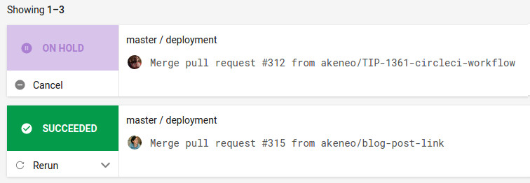
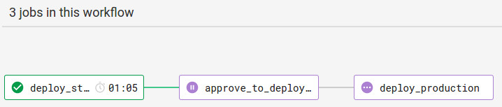

# Akeneo PIM Documentation

The Akeneo PIM documentation foo

## Build the documentation

Install [Docker](https://docs.docker.com/engine/installation/).

Then `make build`.

The docs will be built into `./pim-docs-build`.

## Deploy the documentation

### With Circle CI (recommended)

Once you merge a PR into the `4.0` branch, it is automatically deployed on the staging server. In order to deploy it in production, please follow these steps:

- Check the staging environment if everything is ok to be deployed in production
- Open [the list of merged PR in 4.0 branch](https://circleci.com/gh/akeneo/workflows/pim-docs/tree/4.0) in Circle CI. You have to be connected with your Github account.
- Click on the first row which should be "On hold"

- Click on the box "approve_to_deploy_in_production" and approve. It will launch the deployment in production.

- It's deployed in production in 1 minute!

### Local deployment (not recommended)

Your public SSH key should be deployed on the server (see Ansible configuration). It is strongly recommended to release with the CI process though.

To deploy what you have built, use `HOSTNAME=foo.com PORT=1985 VERSION=bar make deploy`.

`HOSTNAME` is the server to deploy the documentation on.
`PORT` is the SSH port to connect to the server.
`VERSION` is the subdirectory of `/var/www/` where the documentation will be deployed on the the server. It should be something like `3.2`, `4.0` or `master`.

To know the production and staging environments of pim-docs, please read the [inventory](https://github.com/akeneo/ansible/blob/master/inventories/core.inventory).

## Contribution

Don't hesitate to suggest cookbook ideas via https://github.com/akeneo/pim-docs/issues.

## Developer's notes

- The folder `/_themes/sphinx_rtd_theme` is a clone from https://github.com/snide/sphinx_rtd_theme, and was
updated on 2016-07. If you want to customize the Akeneo theme, please only update `/_theme/akeneo_rtd` theme.
