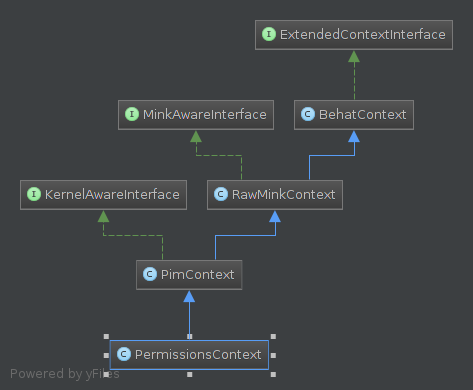
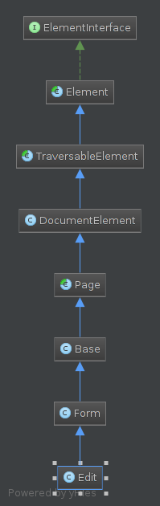
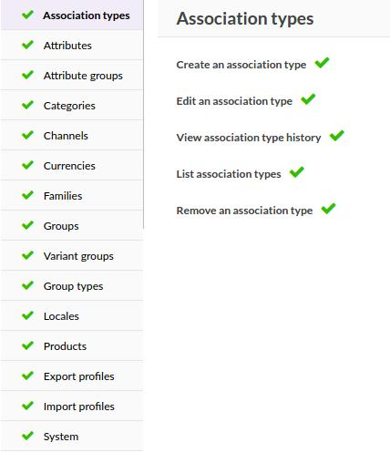
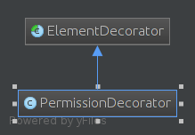

Establishing Decorator Pattern
==============================

As of 1.5, we introduced `Decorator pattern <https://en.wikipedia.org/wiki/Decorator_pattern>`_ to our
Behat architecture in order to facilitate maintenance and new tests development.

.. note::

    Benefits:

    - Dynamically add behavior on NodeElement
    - Detach DOM logic from the Gherkin Page elements
    - Small and cleaned Contexts that does not mix concerns
    - Contexts classified by functionality
    - Re-usable decorators

How Does It Work?
-----------------
Describe Functionality
______________________

To explain how our architecture works, let's take permissions in the system menu as an example.

Gherkin feature:

.. code-block:: gherkin

    Scenario: View only the mass edit operations I have permissions on
        Given I edit the "Catalog manager" Role # Change the current page and ask to Selenium to open it in the navigator.
        And I visit the "Permissions" tab
        And I grant rights to group Products # Here we do the action to grant rights.
        And I revoke rights to resource Change state of product
        And I save the Role
        Then I should not see the text "There are unsaved changes."
        When I am on the products page
        And I mass-edit products kickers and hiking_shoes
        And I should not see "Change status (enable / disable)"

Here we describe what happens if we revoke rights to change state of products to a user in the catalog manager
role group.

Context
_______

Navigate And Change The Current Page
************************************

*Given I edit the "Catalog manager" Role* With this line we change the current page to be on "Role edit".

.. code-block:: php

    // \Pim\Behat\Context\NavigationContext
    /**
     * @param string $identifier
     * @param string $page
     *
     * Gherkin match this regexp
     * @Given /^I edit the "([^"]*)" (\w+)$/
     */
    public function iAmOnTheEntityEditPage($identifier, $page) // $identifier = 'Catalog manager', $page = 'Role'
    {
        $page   = ucfirst($page);
        $getter = sprintf('get%s', $page);
        $entity = $this->getFixturesContext()->$getter($identifier);
        $this->openPage(sprintf('%s edit', $page), ['id' => $entity->getId()]);
    }

    /**
     * @param string $pageName
     * @param array  $options
     *
     * @return \SensioLabs\Behat\PageObjectExtension\PageObject\Page
     */
    public function openPage($pageName, array $options = [])
    {
        // "Role edit" is now our current page. The current Page is the one we are working on.
        $this->currentPage = $pageName;

        // Ask to Selenium to open "/user/role/update/{id}" in the
        // navigator thank to $path containing in "Context\Page\Role\Edit".
        $page = $this->getCurrentPage()->open($options);

        $this->wait();

        return $page;
    }

Selenium will know which URL to go to thanks to `the protected $path attribute
<https://github.com/akeneo/pim-community-dev/blob/master/tests/legacy/features/Context/Page/Role/Edit.php#L19>`_
contained in *Context\\Page\\Role\\Edit*.

You may notice that this Gherkin method still uses the old implementation of Behat in Akeneo PIM.

Call Decorator Method
*********************

*And I grant rights to group Products*

All our new contexts are in the namespace *\\Pim\\Behat\\Context\\Domain* which is classified by domain. Each domain is
linked to a page in Akeneo PIM. That's why, in this namespace, you will find the same architecture as in our main menu.
This organization is very helpful to quickly find the context you are looking for.

We are working on permissions that are localized in the system main menu. So let's see the
`\\Pim\\Behat\\Context\\Domain\\System\\PermissionsContext
<https://github.com/akeneo/pim-community-dev/blob/master/tests/legacy/features/Behat/Context/Domain/System/PermissionsContext.php>`_.

.. code-block:: php

    // \Pim\Behat\Context\Domain\System\PermissionsContext
    /**
     * @param string $action (grant|remove)
     * @param string $group
     *
     * Gherkin will match this regexp
     * @When /^I (grant|revoke) rights to groups? (.*)$/
     */
    public function iSetRightsToACLGroups($action, $groups) // $action = 'grant', $group = 'Products'
    {
        foreach ($this->listToArray($groups) as $group) {
            // In the previous step, we put the current page to "Role edit"
            // Returns an instance of Context\Page\Role\Edit
            $page = $this->getCurrentPage();

            // Returns an instance of Pim\Behat\Decorator\Permission\PermissionDecorator
            $permissionElement = $page->getElement('Permission');

            switch ($action) {
                case 'grant':
                    $method = 'grantGroup';
                    break;
                case 'revoke':
                    $method = 'revokeGroup';
                    break;
                default:
                    throw new \InvalidArgumentException(sprintf('Action "%s" does not exist.', $action));
                    break;
            }

            foreach ($this->listToArray($groups) as $group) {
                // We call the method grantGroup() from the PermissionDecorator
                $permissionElement->$method($group);
            }
        }
    }

Pages
_____

The current page is `Context\\Page\\Role\\Edit
<https://github.com/akeneo/pim-community-dev/blob/master/tests/legacy/features/Context/Page/Role/Edit.php>`_.

When you call *Pim\\Behat\\Context\\NavigationContext->getCurrentPage()* the method will match "Role edit" to
*return new Context\\Page\\Role\\Edit()*. That's why all of our pages are located in a folder named after the name of
the Entity. In this folder, each action has its dedicated page such as Index.php, Creation.php, Edit.php as you can see
in the `Role folder <https://github.com/akeneo/pim-community-dev/tree/master/tests/legacy/features/Context/Page/Role>`_ for example.

The *$page->getElement('Permission')* method will return an instance of
*Pim\\Behat\\Decorator\\Permission\\PermissionDecorator*. In our implementation, each pages list decorators that are
needed in the *$elements* attribute. Pages are only for configuration purpose:

.. code-block:: php

    /**
     * @param Session              $session
     * @param PageFactoryInterface $pageFactory
     * @param array                $parameters
     */
    public function __construct($session, $pageFactory, $parameters = [])
    {
        parent::__construct($session, $pageFactory, $parameters);

        // Here we linked 'Role' to the decorator 'Pim\Behat\Decorator\Permission\PermissionDecorator'
        $this->elements = array_merge(
            [
                'Permission' => [                                            // Arbitrary name that represents the element
                    'css'        => '#rights-action',                        // Selector for the element
                    'decorators' => [
                        'Pim\Behat\Decorator\Permission\PermissionDecorator' // Class that will decorate the element
                    ]
                ],
            ],
            $this->elements
        );
    }

The *$this->getElement('Permission')* method:

.. code-block:: php

    // Context\\Page\\Base\\Base
    /**
     * @param string $name
     *
     * @return Element
     */
    public function getElement($name) // $name = 'Permission'
    {
        $element = parent::getElement($name); // Will return a new Element with the css selector '#rights-action'

        if (isset($this->elements[$name]['decorators'])) {
            $element = $this->decorate($element, $this->elements[$name]['decorators']);
        }

        return $element;
    }

    /**
     * Decorates an element
     *
     * @param NodeElement $element
     * @param array       $decorators
     *
     * @return ElementDecorator
     */
    protected function decorate(NodeElement $element, array $decorators)
    {
        foreach ($decorators as $decorator) { // You may notice that an Element can be decorated by several decorators
            $element = new $decorator($element);
        }

        return $element;
    }

What we achieve here is to get this Element selected with the CSS selector "#rights-action":

Decorating this Element has added behavior from the PermissionDecorator on it. Now the Element will be able to know how
to grant or revoke permission to a group or a resource and navigate through groups. That makes the Page very readable
and clean as the code is dispatched into several methods inside single responsibility decorators.

.. note::

    As Pages are only for decorators configuration purpose, note that in the future they will be removed and replaced
    by a real configuration system. We never add logic in Pages.

Decorator
_________

All decorators are classified in the *tests/legacy/features/Behat/Decorator/* folder. Each sub-folder represents the element that
it decorates. You can find inside folders like *Completeness*, *Field*, *Tab* or for our example *Permission*.
The name of the sub-folder is only the representative name of the element, no prefix, no suffix. Also, decorators classes
have to be suffixed by "Decorator" like *DecoratedElementDecorator*.

The `Pim\\Behat\\Decorator\\Permission\\PermissionDecorator
<https://github.com/akeneo/pim-community-dev/blob/master/tests/legacy/features/Behat/Context/Domain/System/PermissionsContext.php>`_
adds behaviors to an Element to be able to navigate between groups and grant or revoke permissions for resources or groups.

.. code-block:: php

    // abstract class Pim\\Behat\\Decorator\\ElementDecorator
    /** @var mixed The decorated element */
    protected $element;

    /**
     * @param $element
     */
    public function __construct($element)
    {
        $this->element = $element;
    }

When the decorator is instantiated the Element is saved in the protected attribute *$element* in order to be
able to use its own methods in the decorator:

.. code-block:: php

    // Whatever decorator
    /**
     * @param string $foo Something to find
     *
     * @return NodeElement
     */
    public function findSomethingInTheElement($foo)
    {
        return $this->spin(function () use ($foo) {
            return $this->find('css', $foo);
        }, sprintf('Something "%s" not found.', $foo));
    }

The method *$this->find()* is neither in the decorator nor in the abstract class ElementDecorator. The magical method
*__call()* will be called to find if the method *find()* exists in the Element, and call it with arguments:

.. code-block:: php

    // abstract class Pim\\Behat\\Decorator\\ElementDecorator
    /**
     * @param string $name
     * @param array  $arguments
     *
     * @return mixed
     */
    public function __call($name, array $arguments) // $name = 'find', $arguments = ['css', $foo]
    {
        return call_user_func_array([$this->element, $name], $arguments);
    }

That's how we can call methods from the Element class inside decorators. And obviously, that's why all decorators must
extend `Pim\\Behat\\Decorator\\ElementDecorator
<https://github.com/akeneo/pim-community-dev/blob/master/tests/legacy/features/Behat/Decorator/ElementDecorator.php>`_.

.. note::

    You can see that in the ElementDecorator a *decorate()* method exists. It is possible to use it to decorate an
    Element in your decorator. In this example, it could be possible in the PermissionDecorator to create a
    GroupPermissionDecorator to regroup all behavior about groups menu (the left menu in the previous picture) and a
    ResourcePermissionDecorator to regroup all behavior about resources (the right panel in the previous picture).

Now, let's see what happens when *grantGroup()* is called from our context.

.. code-block:: php

    // Pim\Behat\Decorator\Permission\PermissionDecorator
    /**
     * @param string $group
     */
    public function grantGroup($group) // $group = 'Products'
    {
        $iconElement = $this->findGroupIcon($group);

        // Those CSS classes refer to a group that is not already granted
        if ($iconElement->hasClass('icon-remove') || $iconElement->hasClass('icon-circle')) {
            $iconElement->click();
        }
    }

    /**
     * @param $group
     *
     * @return NodeElement
     */
    protected function findGroupIcon($group) // $group = 'Products'
    {
        $groupElement = $this->findGroup($group);

        return $this->spin(function () use ($groupElement) {
            return $groupElement->find('css', '.acl-group-permission-toggle');
        }, sprintf('Group icon "%s" not found', $group));
    }

    /**
     * @param string $group
     *
     * @return NodeElement
     */
    public function findGroup($group) // $group = 'Products'
    {
        return $this->spin(function () use ($group) {
            return $this->find('css', sprintf('.tab-groups .tab:contains("%s")', $group));
        }, sprintf('Group "%s" not found.', $group));
    }

.. note::

    To learn more about spin, please refer to :doc:`spin`.

You may notice that all logic of the element research is located in decorators and is spinned.

If we had several identical permission panels in different pages, each page would have to use the same
decorator. That's why, decorators have to be generic. In case an element differs from one page to another, use a
decorator for those elements and implement same methods the way you need.
