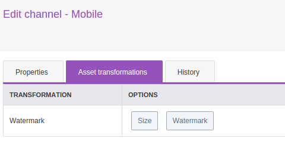

How to Add a New Transformation
===============================

Quick Overview
--------------

**This cookbook is about a feature only provided in the Enterprise Edition.**

Transformations are classes which allow to transform a file from state A to state B.
For example, in the Product Asset specific case, they transform a file coming from a Reference (A) to a Variation file (B).
Each Variation is a transformation of a Reference.

Php5-imagemagick is used in Akeneo PIM but you can add you own library to transform your file.

As Transformations are not specific PIM elements, they are located in `\\Akeneo` and not `\\PimEnterprise`.
Then, you can find in ``Akeneo\Component\FileTransformer`` all business code and in ``Akeneo\Bundle\FileTransformerBundle`` all Symfony2 specific implementation.

Transformation runs with the registry pattern. You have to create your own Transformation implementing ``Akeneo\Component\FileTransformer\Transformation\TransformationInterface`` and register the service with the ``akeneo_file_transformer.transformation`` tag.
Then, compiler pass will inject your tagged Transformation in the registry which will make it available.

.. _registry: http://martinfowler.com/eaaCatalog/registry.html
.. note::
    Learn more about registry_ pattern.

This cookbook assumes that you already created a new bundle to add your new Transformation. Its namespace will be `Acme\CustomBundle`.

Create a New Transformation
---------------------------

For the need of the cookbook, we'll add a watermark transformation.

.. _watermark: http://www.imagemagick.org/Usage/annotating/#wmark_text
.. note::
    To learn more about this transformation you can read the ImageMagick watermark_ documentation.

In order to create your transformation, you have to follow these rules:

 * your transformation has to implement ``Akeneo\Component\FileTransformer\Transformation\TransformationInterface``.
 * your transformation must have a unique name.
 * your transformation service must be tagged ``akeneo_file_transformer.transformation``.

.. code-block:: php

    # /src/Acme/Bundle/CustomBundle/FileTransformer/Transformation/Image/Watermark.php
    <?php

    namespace Acme\CustomBundle\FileTransformer\Transformation\Image;

    use Akeneo\Component\FileTransformer\Options\TransformationOptionsResolverInterface;
    use Akeneo\Component\FileTransformer\Transformation\AbstractTransformation;

    /**
     * Watermark transformation
     */
    class Watermark extends AbstractTransformation
    {
        /** @var ImageMagickLauncher */
        protected $launcher;

        /**
         * @param TransformationOptionsResolverInterface $optionsResolver
         * @param ImageMagickLauncher                    $launcher
         * @param array                                  $supportedMimeTypes
         */
        public function __construct(
            TransformationOptionsResolverInterface $optionsResolver,
            ImageMagickLauncher $launcher,
            array $supportedMimeTypes = ['image/jpeg', 'image/tiff', 'image/png']
        ) {
            $this->optionsResolver    = $optionsResolver;
            $this->supportedMimeTypes = $supportedMimeTypes;
            $this->launcher           = $launcher;
        }

        /**
         * $options = [
         *      'font'      => 'Arial'   by default
         *      'size'      => '12'      by default
         *      'watermark' => 'my mark' what you want to write in watermark
         * ];
         *
         * {@inheritdoc}
         */
        public function transform(\SplFileInfo $file, array $options = [])
        {
            $options  = $this->optionsResolver->resolve($options);

            $fontPart = '-font ' . $options['font'];
            $sizePart = '-pointsize ' . $options['size'];
            $blackWatermarkPart = 'fill black text ' . $options['position'] . ' \'' . $options['watermark'] . '\'';
            $whiteWatermarkPart = 'fill white text ' . $options['position'] . ' \'' . $options['watermark'] . '\'';
            $drawPart = '-draw "gravity south ' . $blackWatermarkPart . ' ' . $whiteWatermarkPart . '"';
            $cmd = $fontPart . ' ' . $sizePart . ' ' . $drawPart;

            $this->launcher->convert($cmd, $file->getPathname());
        }

        /**
         * {@inheritdoc}
         */
        public function getName()
        {
            return 'watermark';
        }
    }

.. _ImageMagickLauncher: https://github.com/akeneo/pim-enterprise-dev/blob/1.4/src/Akeneo/Component/FileTransformer/Transformation/Image/ImageMagickLauncher.php
.. note::
    To see how the imagemagick command is launched, you can take a look at the ImageMagickLauncher_.

In order to rely on options you can add an OptionsResolver, for this you need to follow this rule :

 * your OptionsResolver must implement the ``Akeneo\Component\FileTransformer\Options\TransformationOptionsResolverInterface``.

.. code-block:: php

    #/src/Acme/Bundle/CustomBundle/FileTransformer/Options/Image/WatermarkOptionsResolver.php
    <?php

    namespace Acme\CustomBundle\FileTransformer\Options\Image;

    use Akeneo\Component\FileTransformer\Exception\InvalidOptionsTransformationException;
    use Akeneo\Component\FileTransformer\Options\TransformationOptionsResolverInterface;
    use Symfony\Component\OptionsResolver\OptionsResolver;

    /**
     * Watermark Options Resolver
     */
    class WatermarkOptionsResolver implements TransformationOptionsResolverInterface
    {
        /** @var OptionsResolver */
        protected $resolver;

        public function __construct()
        {
            $this->resolver = new OptionsResolver();
            $this->resolver->setRequired([
                'font',
                'size',
                'watermark',
                'positionBlack',
                'positionWhite',
            ]);
            $this->resolver->setAllowedTypes([
                'font'          => 'string',
                'size'          => 'string',
                'watermark'     => 'string',
                'positionBlack' => 'string',
                'positionWhite' => 'string',
            ]);
            $this->resolver->setDefaults([
                'font'          => 'Arial',
                'size'          => '12',
                'watermark'     => 'Copyright',
                'positionBlack' => '0,45',
                'positionWhite' => '1,43',
            ]);
        }

        /**
         * {@inheritdoc}
         */
        public function resolve(array $options)
        {
            try {
                $options = $this->resolver->resolve($options);
            } catch (\Exception $e) {
                throw InvalidOptionsTransformationException::general($e, 'watermark');
            }

            return $options;
        }
    }

.. _OptionsResolver: http://symfony.com/doc/current/components/options_resolver.html
.. note::
    You can learn more about this Symfony2 component on the OptionsResolver_ documentation.

Next step is to create corresponding services in a dedicated file `services.yml`:

.. code-block:: yaml

    # src/Acme/Bundle/CustomBundle/FileTransformerBundle/Resources/config/services.yml
    parameters:
        akeneo_file_transformer.options.image.watermark.class:        Acme\CustomBundle\FileTransformer\Options\Image\WatermarkOptionsResolver
        akeneo_file_transformer.transformation.image.watermark.class: Acme\CustomBundle\FileTransformer\Transformation\Image\Watermark

    services:
        akeneo_file_transformer.options.image.watermark:
            class: %akeneo_file_transformer.options.image.watermark.class%

        akeneo_file_transformer.transformation.image.watermark:
            class: %akeneo_file_transformer.transformation.image.watermark.class%
            arguments:
                - '@akeneo_file_transformer.options.image.watermark'
                - '@akeneo_file_transformer.transformation.image.image_magick_launcher'
            tags:
                - { name: akeneo_file_transformer.transformation, alias: transformation_watermark }

Translate Asset Transformation Details for Channels
---------------------------------------------------

A translation key is automatically created with the ``Watermark->getName()``. You can translate it in a dedicated translation file:

.. code-block:: yaml

    # src/Acme/Bundle/CustomBundle/Resources/translations/messages.en.yml

    pimee_enrich.asset_transformation.watermark.title: Watermark
    pimee_enrich.asset_transformation.watermark.options.size: Size
    pimee_enrich.asset_transformation.watermark.options.watermark: Watermark
    [...]

Add a Channel Configuration to Use the New Transformation
---------------------------------------------------------

Adding a channel configuration for Reference transformation is a simple YML import :

.. code-block:: csv

    channel;configuration
    mobile;{"watermark":{"size":"15", "watermark":"Copyright Akeneo"}}

.. note::
    Configuration is a json format. All these options are required but as we pushed a default value we can put nothing.

Once you created YML file you can go to Akeneo PIM and then start importing with asset channel configuration import in csv profile.
Be careful, if you import only the previous file, all your previous configurations will be removed. You need to add your own configuration in the file to keep it.

Now try to create an asset and generate variations for your channel. Download the generated file and discover your watermark :

