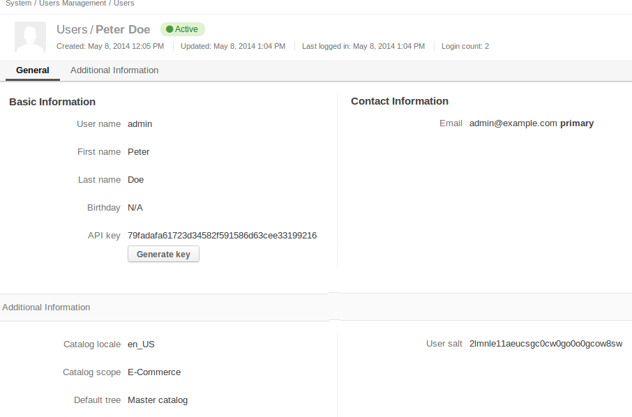

How to Use REST API ?
=====================

The Akeneo PIM comes with a REST API which allows to fetch product data in JSON format.

We're still working on to add new methods to fetch and update other entities.

Configuration
-------------

We first need to generate an API key for a PIM user as shown on following screenshot :

Retrieve the product data
-------------------------

Then we can write a simple script to retrieve some product data :

.. literalinclude:: ../../scripts/rest-api-product.php
   :language: php
   :linenos:

The script can be executed with php-cli : 

.. code-block:: bash

    php rest-api-product.php

