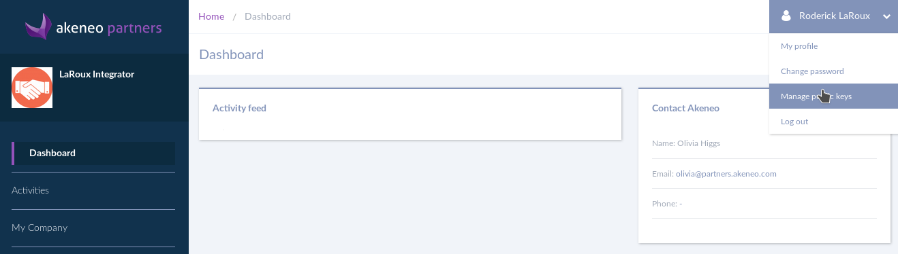
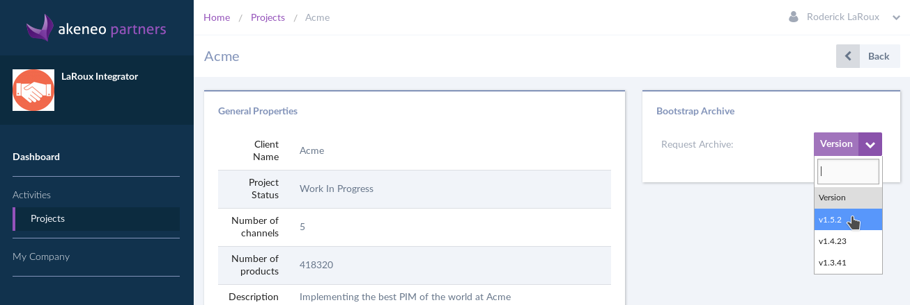

Getting Akeneo Partners Portal access
*************************************
After obtaining your Enterprise Edition license you should have recieved an access to the Akeneo Partners Portal.

If you haven't recieved it you can request one at: http://helpdesk.akeneo.com/

If you are a developer on the project you should request an account to access the project to your company manager (supervisor).

Getting Enterprise Edition access via the Partners Portal
*********************************************************
By default `Composer <https://getcomposer.org/>`_ uses `packagist.org <https://www.packagist.org/>`_. to retrieve all open source packages and their updates.
To download the PIM Enterprise Edition, you have to get access to our private enterprise edition repository by sending your SSH public key to our systems.

Login to the Partners Portal at https://partners.akeneo.com

* In your account go to manage public keys

* Click the following button

.. image:: ./papo/add_public_key.png

* Enter a name, an email and the associated public key file content (usually located at `~/.ssh/id_rsa.pub`) and click save

.. image:: ./papo/add_public_key_2.png

Requesting an archive on the Partners Portal
********************************************
In the left menu click on Activities > Project and then on your project.

On your project page on the right you will find a button to download the archive. We strongly recommend you to choose the latest version.

