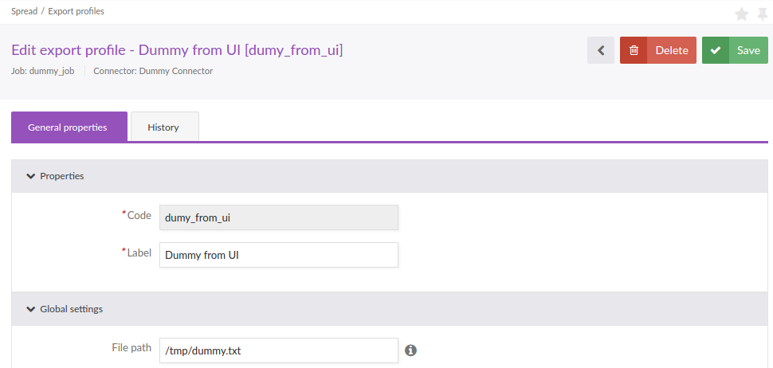

How to create a new Connector
=============================

We'll implement here a very minimalist Connector, it will do nothing but allow us to understand the main concepts and the overall architecture.

Create our Bundle
-----------------

Create a new Symfony bundle:

.. literalinclude:: ../../src/Acme/Bundle/DummyConnectorBundle/AcmeDummyConnectorBundle.php
   :language: php
   :linenos:

Register the bundle in AppKernel:

.. code-block:: php

    public function registerBundles()
    {
        // ...
            new Acme\Bundle\DummyConnectorBundle\AcmeDummyConnectorBundle(),
        // ...
    }

Configure our Job service
-------------------------

Create a file ``Resources/config/jobs.yml`` in our Bundle to configure a new job:

.. literalinclude:: ../../src/Acme/Bundle/DummyConnectorBundle/Resources/config/jobs.yml
    :language: yaml
    :linenos:

Load this file in the bundle extension:

.. literalinclude:: ../../src/Acme/Bundle/DummyConnectorBundle/DependencyInjection/AcmeDummyConnectorExtension.php
    :language: php
    :linenos:
    :lines: 1-15,17-20

Here we use an existing dummy reader, a processor and a writer (they implement relevant interfaces and are usable but they do nothing with data).

The reader is implemented in the class ``Pim\Component\Connector\Reader\DummyItemReader`` which is defined as a service in the ConnectorBundle with the alias ``pim_connector.reader.dummy_item`` in the file ``Resources\config\readers.yml``.

The processor is implemented in the class ``Pim\Component\Connector\Processor\DummyItemProcessor`` which is defined as a service in the ConnectorBundle with the alias ``pim_connector.processor.dummy_item`` in the file ``Resources\config\processors.yml``.

The writer is implemented in the class ``Pim\Component\Connector\Writer\DummyItemWriter``, which is defined as a service in the ConnectorBundle with the alias ``pim_connector.writer.dummy_item`` in the file ``Resources\config\writers.yml``.

We'll explain in next cookbook chapters how to create your own elements with real logic inside.

.. warning::

   Please note that in versions < 1.6, the file was always named "batch_jobs.yml" and was automatically loaded. The file content was very strict, was less standard and upgradeable than it is now.

Configure our JobParameters
---------------------------

To be executed, a Job is launched with a JobParameters which contains runtime parameters.

In our example, let's assume that our job needs a file path where to write data. This path must be provided and the directory has to be writable in order to execute the job.

We have to define a couple of services implementing ``Akeneo\Component\Batch\Job\JobParameters\DefaultValuesProviderInterface`` and ``Akeneo\Component\Batch\Job\JobParameters\ConstraintCollectionProviderInterface``.

The first service provides the default values used to create a JobParameters instance,

.. literalinclude:: ../../src/Acme/Bundle/DummyConnectorBundle/Job/JobParameters/DefaultValuesProvider/DummyExport.php
    :language: php
    :linenos:

.. tip::

    If the job doesn't need any particular parameters, it's possible to use directly the class ``Akeneo\Component\Batch\Job\JobParameters\EmptyDefaultValuesProvider``.

The second service provides the constraints used to validate each parameter of a JobParameters instance,

.. literalinclude:: ../../src/Acme/Bundle/DummyConnectorBundle/Job/JobParameters/ConstraintCollectionProvider/DummyExport.php
    :language: php
    :linenos:

.. tip::

    If the job doesn't need any particular parameters, it's possible to use directly the class ``Akeneo\Component\Batch\Job\JobParameters\EmptyConstraintCollectionProvider``.

These services use tags and implement ``supports()`` method so they can only be used for our job.

.. literalinclude:: ../../src/Acme/Bundle/DummyConnectorBundle/Resources/config/job_parameters.yml
    :language: yaml
    :linenos:
    :lines: 1-3,5-23

As for the ``jobs.yml``, this service file ``job_parameters.yml`` must be loaded in our ``AcmeDummyConnectorExtension``.

.. note::

    We could implement a single class implementing the 2 interfaces and define a single service on both tags.

Create a Job Instance
---------------------

Each Job can be configured through a JobInstance, an instance of the Job.

It means we can define a job and several instances of it, with different configurations.

Please note that this job instance does not take any configuration.

We can create an instance with the following command:

.. code-block:: bash

    # akeneo:batch:create-job <connector> <job> <type> <code> <config> [<label>]
    php app/console akeneo:batch:create-job 'Dummy Connector' dummy_job export my_job_instance '[]'

You can also list the existing job instances with the following command:

.. code-block:: bash

    php app/console akeneo:batch:list-jobs

Execute our new Job Instance
----------------------------

You can run the job with the following command:

.. code-block:: bash

    php app/console akeneo:batch:job my_job_instance

    [2016-07-07 16:48:35] batch.DEBUG: Job execution starting: startTime=, endTime=, updatedTime=, status=2, exitStatus=[UNKNOWN] , exitDescription=[], job=[my_job_instance] [] []
    [2016-07-07 16:48:35] batch.INFO: Step execution starting: id=0, name=[dummy_step], status=[2], exitCode=[EXECUTING], exitDescription=[] [] []
    [2016-07-07 16:48:35] batch.DEBUG: Step execution success: id= 1 [] []
    [2016-07-07 16:48:35] batch.DEBUG: Step execution complete: id=1, name=[dummy_step], status=[1], exitCode=[EXECUTING], exitDescription=[] [] []
    [2016-07-07 16:48:35] batch.DEBUG: Upgrading JobExecution status: startTime=2016-07-07T14:48:35+00:00, endTime=, updatedTime=, status=3, exitStatus=[UNKNOWN] , exitDescription=[], job=[my_job_instance] [] []
    Export my_job_instance has been successfully executed.

The ``--config`` option can be used to override the default values parameters, for instance, to change the file path.

.. code-block:: bash

    php app/console akeneo:batch:job my_job_instance --config='{"filePath":"\/tmp\/new_path.txt"}'

Configure the UI for our JobParameters
--------------------------------------

At this point, the job is usable in command line though it cannot be configured via the UI.

We need to provide a form name to the frontend to be able to render it properly. If your connector doesn't require extra fields, you can use the basic forms shipped with Akeneo:

.. literalinclude:: ../../src/Acme/Bundle/DummyConnectorBundle/Resources/config/providers.yml
    :language: yaml
    :linenos:
    :lines: 1-6

If you want to go further, you can create your own form and re-use common parts provided by default. Here is an example of a full form configuration :download: `Resources/config/form_extensions/acme_job_instance_csv_base_import.yml <../../src/Acme/Bundle/DummyConnectorBundle/Resources/config/form_extensions.yml>`:

.. literalinclude:: ../../src/Acme/Bundle/DummyConnectorBundle/Resources/config/form_extensions.yml
    :language: yaml
    :linenos:
    :lines: 1-329

Register it in the form provider and you are good to go!

.. literalinclude:: ../../src/Acme/Bundle/DummyConnectorBundle/Resources/config/providers.yml
    :language: yaml
    :linenos:
    :lines: 8-13

Configure a custom field in our UI for Job
------------------------------------------

If you want to add a custom field such as a "select" field with custom data, you will have to create your own JS module with dynamic choices.

First, you will have to create a controller (with a conform routing configuration) which return the list on a JSON format for example:

.. code-block:: php
    
    class MyCustomController
    {
        ...

        public function listAction() {
            $choices['my_option_1'] = 'my_option_1';
            $choices['my_option_2'] = 'my_option_2';

            return new JsonResponse($choices);
        }
    }

Then configure a fetcher:

.. literalinclude:: ../../src/Acme/Bundle/DummyConnectorBundle/Resources/config/requirejs.yml
    :language: yaml
    :linenos:

The JS module itself:

.. literalinclude:: ../../src/Acme/Bundle/DummyConnectorBundle/Resources/public/js/my-custom-choices-list.js
    :language: javascript
    :linenos:

The translation configuration:

.. literalinclude:: ../../src/Acme/Bundle/DummyConnectorBundle/Resources/translations/jsmessages.en.yml
    :language: yaml
    :linenos:

And to finish, activate you custom field into your form configuration:

.. literalinclude:: ../../src/Acme/Bundle/DummyConnectorBundle/Resources/config/form_extensions.yml
    :language: yaml
    :linenos:
    :lines: 331-342

Conclusion
----------

We can now create a new configuration for our Job from the UI, using the menu "spread > export profiles" then "create export profile" button.

