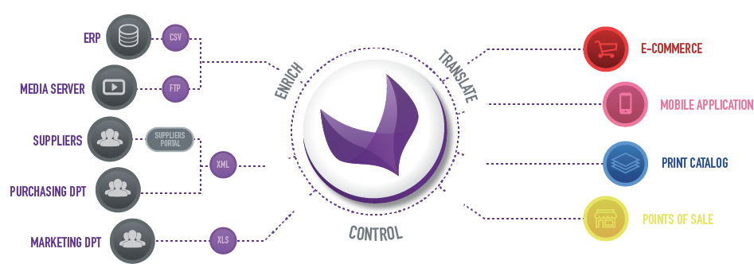

Akeneo PIM in a nutshell
========================

What is a PIM?
**************

A Product Information Management (PIM) solution is aimed to centralize all the marketing data, to enrich, translate and prepare it for exports to multiple channels.
It is a productivity tool helping the contributors to serve the product information in different languages and for different purposes.

Akeneo is the first open source PIM made for non-technical users.
Easy to use and very flexible, the solution can adapt to your product organization and processes, not the other way around.
Available in two editions, Community, and Enterprise, you can choose the one that fits your needs.

What is a product?
------------------

Akeneo provides a powerful and very flexible way to structure your products using an Entity Attribute Value (i.e. Product - Attribute - ProductValue) model.

For instance, let's say we want to store cars in Akeneo.

A Car has multiple properties (or attributes):

- A color
- A manufacturer
- A price (a value and a currency)
- ...

We build the Car *Family* (or "product type") using *Attributes*.
Akeneo is shipped with common attribute types:

- text;
- price;
- picture;
- date...

Once a Family is created, you can create products organized in one or multiples *Categories*,
for example "Tesla Model X" in "electrical motorization" category.

Most of the time, we export data to various destinations: an eCommerce website, a mobile application, or a paper catalog.
You can use Channels to provide a different data for each product according to the selected destination.

When you start a PIM project, the first task to do is to build the structure of the data from a "functional" point of view.

.. note::

    Want to know more? Take a look at the :doc:`/technical_overview/product_information/index` reference.

How does it work?
*****************

As a developer, you will mainly interact with Akeneo to import and export data.
We create Import and Export tasks using *Jobs* put in *Connectors*.

A job?
------

A Job defines a series of steps to execute to do a task.

To import data in Akeneo, we need:

- to read data and convert it into an understandable format;
- to map and validate this data into products;
- to save them into database.

To export data from Akeneo, we need:

- to read data from database;
- to process it into an understandable format (XML, JSON, CSV...);
- to export data into plain files or through a web service.

Because Akeneo PIM is open source, multiple connectors - or modules - already exist both for importing or exporting data.

.. note::

    Want to know more? Take a look at the :doc:`/import_and_export_data/index` reference.

That's it! You now have the basic knowledge to start an Akeneo project.

.. toctree::
    :maxdepth: 2
    :titlesonly:
    :hidden:

    install_pim/index
    migrate_pim/index
    import_and_export_data/index
    manipulate_pim_data/index
    design_pim/index
    maintain_pim/index
    contribute_to_pim/index

.. toctree::
    :maxdepth: 2
    :titlesonly:
    :hidden:

    technical_overview/index
    technical_architecture/index
    cloud_edition/index
    onboarder/index
