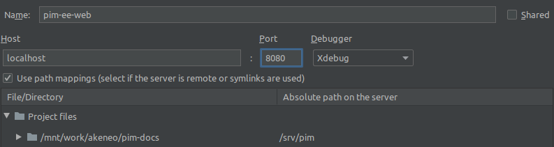

Install Akeneo PIM for development with Docker
==============================================

System requirements
-------------------

 - `docker 20+`: `Docker installation <https://docs.docker.com/install/>`_
 - `docker-compose 1.29+`: `docker-compose installation <https://docs.docker.com/compose/install/>`_
 - `make`
 - `bash`

Setting up your host user
*************************

The PIM is shared with the containers as `a volume <https://docs.docker.com/engine/admin/volumes/volumes/>`_.

The PIM root is available as `/srv/pim` inside the containers.

These containers all have a default user with 1000:1000 as UID:GID.
So, on Linux hosts, **it is mandatory that the user of your host machine has 1000:1000 as UID and GID too**.
Otherwise you'll end up with a non-working PIM.

You won't face this problem on Mac OS and Windows hosts, as those systems use a VM between the host and Docker, which already operates with appropriate UID/GID.

Configuring you package manager
*******************************

*Composer* and *Yarn* caches are shared between the host and the containers to accelerate the installation of Akeneo PIM dependencies.

The default values defined in `docker-compose.yml` match the default values for the `composer` and `yarn` directories:
 - Composer: `~/.composer`
 - Composer cache directory: `~/.cache/composer`
 - Yarn: `~/.cache/yarn`

On some older versions of Composer, the default cache director can be located at `~/.composer/cache`

.. note::
    If you are using non standard directories for Composer and Yarn, set the following environment variables:
     - Composer: `COMPOSER_HOME <https://getcomposer.org/doc/03-cli.md#composer-home>`_
     - Composer cache dir: `COMPOSER_CACHE_DIR <https://getcomposer.org/doc/03-cli.md#composer-cache-dir>`_
     - Yarn: `HOST_YARN_HOME`

Creating the PIM project
------------------------
Community Edition
*****************

The following command will create a PIM project in the current directory. Please note this directory must be empty.

.. code-block:: bash

    $ mkdir pim
    $ cd pim
    $ docker run -ti -u www-data --rm \
        -v $PWD:/srv/pim -v ~/.composer:/var/www/.composer -w /srv/pim \
        akeneo/pim-php-dev:8.1 php /usr/local/bin/composer create-project \
        akeneo/pim-community-standard /srv/pim "7.0.*@stable"

.. note::
    Alternatively, you can download an archive of Akeneo PIM CE containing all the PHP dependencies here:
    https://download.akeneo.com/pim-community-standard-v7.0-latest-icecat.tar.gz

Enterprise Edition
******************

You need to get a PIM Enterprise Standard archive from the Partners Portal. See  `Portal documentation <https://help.akeneo.com/portal/articles/get-akeneo-pim-enterprise-archive.html?utm_source=akeneo-docs&utm_campaign=portal_archive>`_

.. code-block:: bash

    $ tar -xvzf pim-enterprise-standard-v7.0.tar.gz
    $ cd pim-enterprise-standard
    $ docker run -ti -u www-data --rm \
        -v $PWD:/srv/pim -v ~/.ssh:/var/www/.ssh -w /srv/pim \
        akeneo/pim-php-dev:8.1 php /usr/local/bin/composer install

.. note::
    The above Docker command uses a volume to make your SSH private key available to the container, in order for it to access
    the distribution server.

    If you are using a SSH Agent, you can as well provide a volume to access your SSH Agent from the container:

    .. code-block:: bash

        $ docker run -ti -u www-data -v $PWD:/srv/pim -v $SSH_AUTH_SOCK:/ssh-auth.sock -e SSH_AUTH_SOCK=/ssh-auth.sock -w /srv/pim --rm akeneo/pim-php-dev:8.1\
            /usr/local/bin/composer install

    See https://github.com/docker-library/docs/tree/master/composer/#private-repositories--ssh-agent for more details.

Launching the PIM in dev mode
-----------------------------

.. note::

   All `make` commands must be run from the PIM root directory, either created by the archive or from the composer create project above.

.. code-block:: bash

	$ make dev
  # Or
  $ docker run -ti -u www-data -v $(pwd):/srv/pim -v $SSH_AUTH_SOCK:/ssh-auth.sock -e SSH_AUTH_SOCK=/ssh-auth.sock -w /srv/pim --rm akeneo/pim-php-dev:8.1 composer install
  $ docker run -ti -u www-data -v $(pwd):/srv/pim -v $SSH_AUTH_SOCK:/ssh-auth.sock -e SSH_AUTH_SOCK=/ssh-auth.sock -w /srv/pim --rm akeneo/pim-php-dev:8.1 composer install

Once this command is finished, the PIM is accessible on http://localhost:8080/

Launching the PIM in prod mode
------------------------------

.. code-block:: bash

   $ make prod

Once this command is finished, the PIM is accessible on http://localhost:8080/

Stopping the PIM
----------------

.. code-block:: bash

   $ make down

.. note::
    As the database lives inside the MySQL container, stopping it will remove all your data.
    You can add a `docker-compose.override.yml` in order to have a dedicated volume for
    your MySQL data outside (`/var/lib/mysql`) of the container, in order to persist them.
    Same note applies as well on the Elasticsearch container (`/usr/share/elasticsearch/data`).

Install and run Akeneo
----------------------

Configuring Akeneo
******************

Akeneo PIM is configured with environment variables. The `Symfony documentation <https://symfony.com/doc/current/configuration.html#configuration-based-on-environment-variables>`_ explains how to use them.

Running jobs
************

Akeneo PIM implements a queue for the :doc:`/import_and_export_data/index` jobs, as a PHP daemon. This daemon is a Symfony command, that can only execute one job at a time. It does not consume any other job until the job is finished.

You can launch several daemons to allow the execution of several jobs in parallel. A daemon checks the queue every second and executes the next job in the queue.

To launch a daemon, run the following command:

.. code-block:: bash

   $ APP_ENV=dev make start-job-worker

If you want to execute only one job:

.. code-block:: bash

   $ APP_ENV=dev make start-job-worker O="--limit=1"

.. warning::

   Before stopping or destroying your containers, remember to first stop this daemon if you launched it in the background, or you'll end up with a stuck FPM container, and will need to completely restart Docker.
   Please note that this command sends a stop signal to all the consumers. If a job is running while the stop signal is sent, the consumer will wait for the end of the running job before ending.

   .. code-block:: bash

     $ make stop-workers

Xdebug
******

*Xdebug* is disabled by default, by setting the *Xdebug mode* to *off*.

You can change the mode via the ``XDEBUG_MODE`` environment variable.

See `Xdebug modes documentation <https://xdebug.org/docs/all_settings#mode>`_ for a complete list of available modes.

For example, enable step debugging on fpm service:

.. code-block:: bash

    $ XDEBUG_MODE=debug make dev

Or on a PHP CLI script:

.. code-block:: bash

      $ XDEBUG_MODE=debug docker-compose run --rm php php my-script.php

If you are using PHPStorm, open the settings windows and go to ``Languages & Framework > PHP > Servers``. Then add two servers name ``pim-docker-web`` and ``pim-docker-cli``.

Host: ``localhost``
Port: ``8080``
PIM files are located in ``/srv/pim`` on the php and fpm containers.

Docker on production
--------------------

We do not provide a fully ready Docker production image.
If you want to build your own Docker production image, you can use our base image: https://hub.docker.com/r/akeneo/pim-php-base
