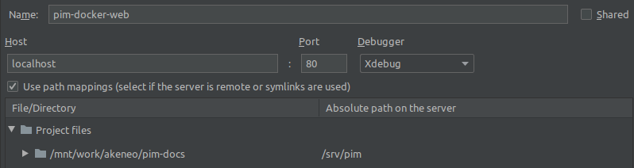

Install Akeneo PIM with Docker
==============================

System requirements
-------------------

Docker and Docker Compose
*************************

Please refer to `docker installation <https://docs.docker.com/install/>`_ and `docker compose <https://docs.docker.com/compose/install/>`_ documentations if you don't already have installed them on your system.

Setting up your host user
*************************

The PIM is shared with the containers as `a volume <https://docs.docker.com/engine/admin/volumes/volumes/>`_.
The *FPM* and *PHP* containers have write access to the ``var`` folder and *node* container has write access to the ``web`` folder.

These containers all have a default user with 1000:1000 as UID:GID, so on Linux hosts **it is mandatory that the user of your host machine has 1000:1000 as UID and GID too**, otherwise you'll end up with a non-working PIM.

You won't face this problem on Mac OS and Windows hosts, as those systems use a VM between the host and Docker, which already operates with appropriate UID/GID.

Configure you package manager
*****************************

*Composer* and *Yarn* caches are shared between the host and the containers to accelerate the installation of Akeneo PIM dependencies.
This is achieved by `bind mounting <https://docs.docker.com/storage/bind-mounts/>`_ the cache folders of your host machine into the containers.
Environment variables are available to set up those folders:

.. code-block:: bash

    HOST_COMPOSER_HOME=/path/to/composer/home docker-compose run --rm php php -d memory_limit=4G /usr/local/bin/composer update
    HOST_YARN_HOME=/path/to/yarn/home docker-compose run --rm note yarn install

.. warning::

    You need to be sure these folders exist **on your host** before launching the containers. If not, Docker will create them for you, but with root permissions, preventing the containers from accessing it. As a result, dependencies installation will fail.

The cache of composer is usually in its home folder, in a ``cache`` subdirectory (in other words, in ``~/.composer/cache``). However, on some Linux systems, the Composer cache and configuration are separated in different folders:
- composer home will be in ``~/.config/composer`` (it contains your GitHub token, mandatory to install the dependencies of ``akeneo/pim-community-standard`` or of the Enterprise Edition),
- composer cache will be in ``~/.cache/composer``.

Use the Docker images
---------------------

.. note::

   All ``docker-compose`` and ``docker`` commands must be run from the folder containing the *Docker compose* file. For convenience, we provide easy to use commands via `makefile`.

Currently, our PHP image is not registered on Docker. So you need to build it locally:

.. code-block:: bash

	make php-image-dev

Make sure you have the latest versions of the images by running:

.. code-block:: bash

   $ docker-compose pull --ignore-pull-failures

To start your containers, run:

.. code-block:: bash

   $ make up

To stop the containers, run:

.. code-block:: bash

   $ docker-compose stop

but if you want to completely remove everything (containers, networks and volumes), then run:

.. code-block:: bash

   $ make down

Of course, it does not delete the Akeneo application you cloned on your machine, only the Docker containers. However, it destroys the database and everything it contains.

Install and run Akeneo
----------------------

Configure Akeneo
****************

Akeneo PIM is configured with environment variables. The `Symfony documentationv<https://symfony.com/doc/current/configuration.html#configuration-based-on-environment-variables>`_ explains how to use them.

Install Akeneo
**************

Now, you can initialize Akeneo by running:

.. code-block:: bash

   $ make pim-prod

.. note::
   If you are using Docker for Windows, there may be issues with symlinks that lead to errors during ``yarn run webpack``. If you encounter these issues, try leaving out the --symlink parameter from the ``pim:installer:assets`` commands.

.. code-block:: bash

   $ make up

**You should now be able to access Akeneo PIM from your host through ``http://localhost:8080/``. The default username and password are both ``admin``.**

.. note::
   The given commands setup a PIM with Symfony's `prod` environment. If you want to work on another mode, like `dev` or `test` for instance, please export ``APP_ENV`` with the right Symfony environment. Available environments are ``prod``, ``dev``, ``behat`` and ``test``. For example:

.. code-block:: bash

   $ APP_ENV=dev make up

.. note::
   If you are using the minimal catalog please run the following command because this catalog does not have any user:

   .. code-block:: bash

       $ docker-compose --rm php php bin/console pim:user:create --admin -n -- admin admin test@example.com John Doe en_US

Run imports and exports
***********************

Akeneo PIM implements a queue for the jobs, as a PHP daemon. This daemon is a Symfony command, that can only execute one job at a time. It does not consume any other job until the job is finished.

You can launch several daemons to allow the execution of several jobs in parallel. A daemon checks every 5 seconds the queue, so it's not real-time.

To launch a daemon, run the following command:

.. code-block:: bash

   APP_ENV=prod docker-compose run --rm php php bin/console akeneo:batch:job-queue-consumer-daemon

If you want to launch the daemon in the background:

.. code-block:: bash

   APP_ENV=prod docker-compose run --rm php php bin/console akeneo:batch:job-queue-consumer-daemon &

If you want to execute only one job:

.. code-block:: bash

   APP_ENV=prod docker-compose run --rm php php bin/console akeneo:batch:job-queue-consumer-daemon --run-once

.. note::

   There is no need to launch a daemon for behat and integration tests. It is performed automatically, the daemon being killed once the test is finished.

.. warning::

   Before stopping or destroying your containers, remember to first stop this daemon if you launched it in the background, or you'll end up with a stuck FPM container, and will need to completely restart Docker.

   .. code-block:: bash

      $ docker-compose run --rm php php pkill -f job-queue-consumer-daemon

Xdebug
******

*Xdebug* is deactivated by default. If you want to activate it, you can use the environment variable ``XDEBUG_ENABLED`` and set its value to 1.

Enable it on fpm service:

.. code-block:: bash

    $ XDEBUG_ENABLED=1 make up

Enable it on php service:

.. code-block:: bash

      $ XDEBUG_ENABLED=1 docker-compose run --rm php php my-script.php

If you are using PHPStorm, open the settings windows and go to ``Languages & Framework > PHP > Servers``. Then add two servers name ``pim-xx`` and ``pim-xx-cli`` (``xx`` could be ``ce`` or ``ee`` depending the edition you are working on)

Host: ``localhost``
Port: ``8080``
PIM files are located in ``/srv/pim`` on the php and fpm containers.

Run behat tests
---------------

The tests have to be run inside the containers. Start by configuring Behat:

.. code-block:: bash
    $ make behat.yml

What if?
--------

I want to see my tests running
******************************

The docker image ``selenium/standalone-firefox-debug`` comes with a VNC server in it. You need a VNC client, and to connect to ``localhost:5910``. The VNC password is `secret`.

You will then be able to see your browser and your tests running in it!

I never want to see my tests running
************************************

In this case, you don't need to have a VNC server in your selenium container.

You can achieve that simply by replacing the image ``selenium/standalone-firefox-debug`` by ``selenium/standalone-firefox``. The first is based on the second, simply adding the VNC server.

Don't forget to also remove the binding on port 5900, now useless as ``selenium/standalone-firefox`` does not expose it.

I want to run my tests in Chrome instead of Firefox
***************************************************

Then all you need to do is to replace the image ``selenium/standalone-firefox-debug`` by ``selenium/standalone-chrome-debug`` (or ``selenium/standalone-chrome`` if you don't want to see the browser in action).
