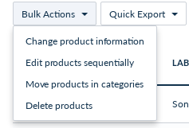

How to Register a New Mass Edit Action on Products
==================================================

The Akeneo PIM comes with a number of mass edit actions.
It also comes with a flexible way to define your own mass edit actions
on selected products.

Prerequisite
------------
The mass edit action uses the `BatchBundle
<https://github.com/akeneo/pim-community-dev/tree/master/src/Akeneo/Bundle/BatchBundle>`_ in order to run mass edit in the background. Readers and Writers are already
created so in this cookbook we will focus on how to create a Mass Edit Action and create a Processor.
For more information on how to create Jobs, Readers, Processors, or Writers please see :doc:`/import_and_export_data/index`.

Phase 1: Create the Operation
-----------------------------

.. tip::

    **Operations** are designed to build and transport the configuration (*eventually via a form*) that will be sent to the background job.
    No item is updated from here!

The first step is to create a new class in the Operation folder that extends ``AbstractMassEditOperation`` and declare this new class as a service in the mass_actions.yml file.

.. literalinclude:: ../../src/Acme/Bundle/CustomMassActionBundle/MassEditAction/Operation/CapitalizeValues.php
   :language: php
   :prepend: // /src/Acme/Bundle/CustomMassActionBundle/MassEditAction/Operation/CapitalizeValues.php
   :linenos:

2 things will be sent to the Job:
  - ``actions``: the raw configuration actions, you define **what you want here**. It will be available within your Job. That's what ``getActions()`` is used for. Here actions are hard-coded, but it could be generated by another method or something else.
  - ``filters``: the selection filter to tell the job which items it will work on. It's used by the Reader.

Once the Operation is created, you must register it as a service in the DI with the ``pim_enrich.mass_edit_action`` tag:

.. literalinclude:: ../../src/Acme/Bundle/CustomMassActionBundle/Resources/config/mass_actions.yml
   :language: yaml
   :prepend: # /src/Acme/Bundle/CustomMassActionBundle/Resources/config/mass_actions.yml
   :linenos:

As you can see, the tag needs several parameters:

- ``name``: Tag name to identify all mass edit operations in the PIM
- ``alias``: Alias of the operation, should be unique among your operations
- ``acl``: The ACL the operation is linked to
- ``datagrid``: The datagrid name this operation appears on
- ``form_type``: The FormType name this operation uses to be configured
- ``operation_group``: The group the operation belongs to (to regroup operations, see below screenshot)

.. note::

    The alias will be used in the URL (``/enrich/mass-edit-action/capitalize-values/configure``)

Phase 2: Create the Form extension
----------------------------------

For this step, you'll need to register a new form extension in ``/src/Acme/Bundle/CustomMassActionBundle/Ressources/config/form_extensions/mass_edit/product.yml``:

.. code-block:: yml

    extensions:
        pim-mass-product-edit-product-custom:
            module: pim/mass-edit-form/product/custom
            parent: pim-mass-product-edit
            position: 210
            targetZone: custom
            config:
                title: pim_enrich.mass_edit.product.step.custom.title

Then, you will have to create a requirejs module for this extension (``/src/Acme/Bundle/CustomMassActionBundle/Ressources/public/js/mass-edit/form/product/custom.js``) :

.. code-block:: js

    'use strict';

    define(
        [
            'underscore',
            'pim/mass-edit-form/product/operation',
            'pim/template/mass-edit/product/change-status'
        ],
        function (
            _,
            BaseOperation,
            template
        ) {
            return BaseOperation.extend({
                template: _.template(template),
                events: {},

                /**
                 * {@inheritdoc}
                 */
                render: function () {},
            });
        }
    );

Finally, you will have to require your custom module into the ``/src/Acme/Bundle/CustomMassActionBundle/Ressources/config/requirejs.yml``.

.. code-block:: yml

    config:
        paths:
            pim/mass-edit-form/product/custom: pimacme/js/mass-edit/form/product/custom

Phase 3: Create the Processor
-----------------------------

Well! Now the user can select the Operation to launch it. The Operation will send its config (``filters``, and ``actions``) to a background job process. Now we have to write the Processor that will handle product modifications.

The ``Processor`` receives products one by one, given by the ``Reader``:

.. literalinclude:: ../../src/Acme/Bundle/CustomMassActionBundle/Connector/Processor/MassEdit/Product/CapitalizeValuesProcessor.php
    :language: php
    :prepend: // /src/Acme/Bundle/CustomMassActionBundle/Connector/Processor/MassEdit/Product/CapitalizeValuesProcessor.php
    :linenos:

Again, register the newly created class:

.. literalinclude:: ../../src/Acme/Bundle/CustomMassActionBundle/Resources/config/processors.yml
    :language: yaml
    :prepend: # /src/Acme/Bundle/CustomMassActionBundle/Resources/config/processors.yml
    :linenos:

Phase 4: Create the background Job
----------------------------------

.. tip::

    The Step will run 3 steps: **Read**, **Process** & **Write**. In this cookbook, we use existing Reader and Writer.

We just wrote the Processor in the previous phase, so let's tell the Job which services to use!

First of all you need to define a new job as follows:

.. literalinclude:: ../../src/Acme/Bundle/CustomMassActionBundle/Resources/config/jobs.yml
    :language: yaml
    :prepend: # /src/Acme/Bundle/CustomMassActionBundle/Resources/config/jobs.yml
    :linenos:

Then you need to define your step with the proper **Reader**, **Processor** and **Writer**.

.. literalinclude:: ../../src/Acme/Bundle/CustomMassActionBundle/Resources/config/steps.yml
    :language: yaml
    :prepend: # /src/Acme/Bundle/CustomMassActionBundle/Resources/config/steps.yml
    :linenos:

You also need to set job parameters:

.. literalinclude:: ../../src/Acme/Bundle/CustomMassActionBundle/Resources/config/job_parameters.yml
    :language: yaml
    :prepend: # /src/Acme/Bundle/CustomMassActionBundle/Resources/config/job_parameters.yml
    :linenos:

The Job has to be in your database, so add it to your fixtures:

.. literalinclude:: ../../src/Acme/Bundle/CustomMassActionBundle/Resources/fixtures/jobs.yml
    :language: yaml
    :prepend: # /src/Acme/Bundle/CustomMassActionBundle/Resources/fixtures/jobs.yml
    :linenos:

.. note::

    To better understand how to handle this, you can read this chapter: :ref:`add-your-own-data`

If your installation is already set up, use the `akeneo:batch:create-job` command:

.. code-block:: bash

    php bin/console akeneo:batch:create-job "Akeneo Mass Edit Connector" "mass_edit_capitalize_values" "mass_edit" "mass_edit_capitalize_values" '{}' "Mass capitalize product values"

.. warning::

    For Enterprise Edition version, see Phase 6 to add job profile permissions in pimee_security_job_profile_access table.

Phase 5: Translating the Mass Edit Action Choice
------------------------------------------------

Once you have realized the previous operations (and eventually cleared your cache), you should see a new option on the ``/enrich/mass-edit-action/choose`` page.

Akeneo will generate for you a translation key following this pattern:
``pim_enrich.mass_edit_action.%alias%.label``.

You may now define some translation keys (``label, description, success_flash...``) in your translations catalog(s).

.. literalinclude:: ../../src/Acme/Bundle/CustomMassActionBundle/Resources/translations/messages.en.yml
  :language: yaml
  :prepend: # /src/Acme/Bundle/CustomMassActionBundle/Resources/translations/messages.en.yml
  :linenos:

Phase 6: Add user groups permissions to job profiles (ENTERPRISE EDITION)
------------------------------------------------------------------------------------

In Enterprise Edition version, job profiles are managed with user groups permissions, so you need to add these permissions.
To deal with these permissions, you have 3 tables:

- ``akeneo_batch_job_instance``: which stores the job profiles
- ``oro_access_group``: which stored the user groups
- ``pimee_security_job_profile_access``: which stores the permissions (this table only exists in Enterprise Edition)

You have to get your job instance (job profile) code from the first table, get the user groups from your second table and then
execute an insert SQL query to add these permissions.
It will be something like:

.. code-block:: sql

    INSERT INTO pimee_security_job_profile_access VALUES ('', <job_profile_id>, <user_group_id>, 1, 1);

The two last numbers means you give respectively 'edit' and 'execution' permissions. Otherwise add '0'.
