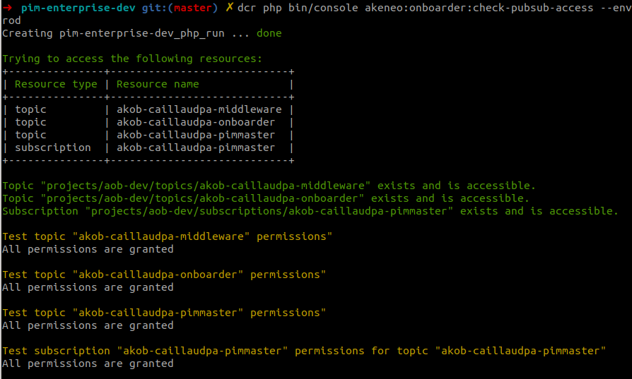

Troubleshooting
===============

Running the job queue daemon command line leads to errors
---------------------------------------------------------

.. code-block:: bash

    batch.ERROR: Encountered an error executing the step: No project ID was provided, and we were unable to detect a default project ID.

If you encounter this kind of error in ``var/logs/*.log``, it's because the job queue daemon command line isn't aware of the mandatory environment variables needed to run the onboarder properly.

If you launch this daemon :doc:`using supervisor configuration </install_pim/manual/daemon_queue>` as recommended by the PIM installation manual you have to configure :doc:`the mandatory environment variables </onboarder/installation/index>` that the akeneo/pim-onboarder bundle requires in the ``/etc/supervisor.conf`` file.

.. code-block:: bash

    [supervisord]
    environment=ONBOARDER_GOOGLE_APPLICATION_CREDENTIALS="/srv/pim/serviceAccount.json",ONBOARDER_TOPIC_NAME_FOR_PUBLICATION_TO_MIDDLEWARE="middleware-topic-name",...

You can check if Google Pub/Sub access is successfully configured by using the following command in your pim

.. code-block:: bash

    php bin/console akeneo:onboarder:check-pubsub-access --env=prod

Proposals from Onboarder don't show up in the PIM
---------------------------------------------------

If you don't received proposals into the PIM, double check that you have rightfully setup and configure your workers, see :doc:`synchronization </onboarder/synchronization/index>` page.

Please also check that in your .env file you have an `ONBOARDER_GOOGLE_APPLICATION_CREDENTIALS` entry. More details in the :doc:`installation </onboarder/installation/index>` page at "Set the configuration values" section.