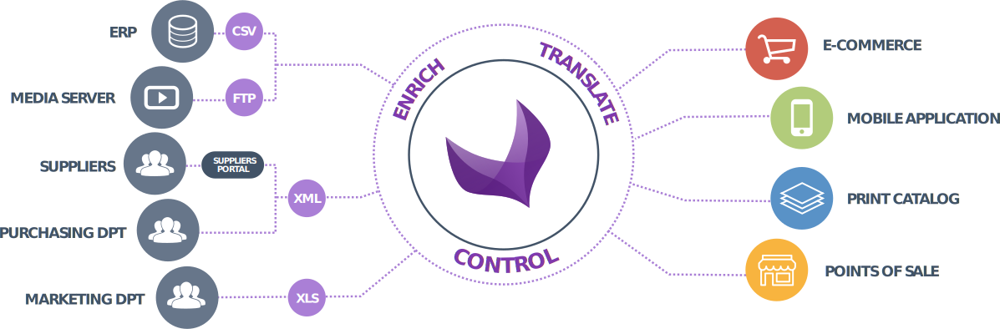
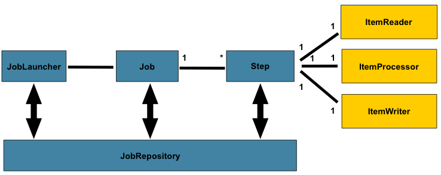
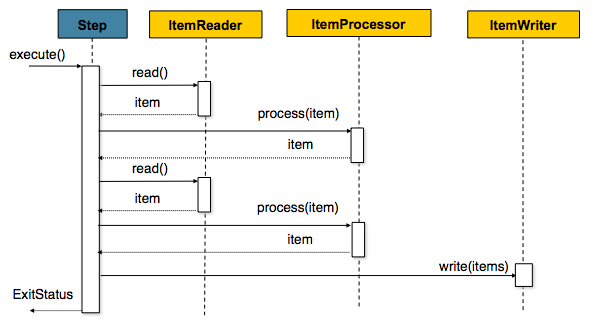

Main Concepts
=============

Like your catalog, your data sources, channels and business rules are unique.

This is why a common task is to work on connectors to import and export the PIM data as expected.

Akeneo PIM comes with a set of configurable connectors based on re-usable classes and services.

Overview
--------

The Import/Export system is based on Akeneo Batch component and bundle.

It helps to define "high level" jobs such as imports, exports and mass actions.

Here are the main objects of the architecture.

.. note::

    Akeneo Batch is widely based on Spring Batch http://projects.spring.io/spring-batch/, it implements a very small part of the original work, and mainly provides reusable functions to process large volumes of records.

Connector
---------

A Connector is packaged as a Symfony bundle.

It contains classes, services and configurations to register new Jobs in Akeneo PIM.

Job
---

Being the main batch domain object, a job is an explicit abstraction representing its configuration specified by a developer.

``Akeneo\Component\Batch\Job\JobRepositoryInterface`` handles how jobs are stored, updated and retrieved.

``Akeneo\Bundle\BatchBundle\Launcher\JobLauncherInterface`` allows to run a Job.

Each Job has a name, its unique identifier.
Each Job can be composed of different Steps.
A Job is declared as a Symfony service using the tag 'akeneo_batch.job'.

JobParameters
-------------

The execution of a Job is configured through a JobParameters which represents the runtime parameters.

Several business services help to manipulate the JobParameters,

 - ``Akeneo\Component\Batch\Job\JobParametersFactory`` to create a JobParameters for a given Job
 - ``Akeneo\Component\Batch\Job\JobParametersValidator`` to validate the JobParameters to be used within a Job
 - ``Akeneo\Component\Batch\Job\JobParameters\DefaultValuesProviderInterface`` to provide the default values used to create a JobParameters
 - ``Akeneo\Component\Batch\Job\JobParameters\ConstraintCollectionProviderInterface`` to provide the constraints used to validate a JobParameters

Step
----

The default class used for a Step is the ``Akeneo\Component\Batch\Step\ItemStep``.

It contains a ``Akeneo\Component\Batch\Item\ItemReaderInterface``, a ``Akeneo\Component\Batch\Item\ItemProcessorInterface`` and a ``Akeneo\Component\Batch\Item\ItemWriterInterface``.

For instance, when we import a CSV file of products,

* Reader reads all CSV lines and provides them as an array item, one by one
* Processor transforms an array item to a product object and returns it
* Writer writes a chunk of objects into the database

.. note::

  You can use your own Step by implementing ``Akeneo\Component\Batch\Step\StepInterface``.
