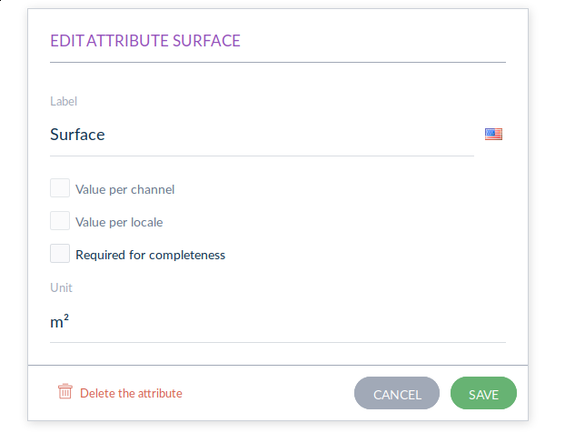
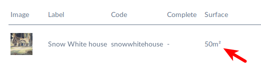

Add a Custom Property to Your Custom Attribute Type
===================================================

.. note::

   Reference Entities feature is only available for the **Enterprise Edition**.

In the `previous tutorial`_, we've created a custom simple metric attribute.
In this tutorial, we will add a new custom property to this attribute. For the simple metric, we will add a "Unit" property.

.. _previous tutorial: ./create_new_attribute_type.html

1) The custom property
^^^^^^^^^^^^^^^^^^^^^^

First we should create the object that will represent the Unit itself:

.. code-block:: php

    <?php

    namespace Acme\CustomBundle\Domain\Model\Attribute;

    class AttributeMetricUnit
    {
        /** @var string */
        private $metricUnit;

        private function __construct(string $metricUnit)
        {
            $this->metricUnit = $metricUnit;
        }

        public static function fromString(string $metricUnit): self
        {
            return new self($metricUnit);
        }

        public function normalize(): string
        {
            return $this->metricUnit;
        }
    }

Now let's add this custom property to our existing custom attribute:

.. code-block:: php

    <?php

    namespace Acme\CustomBundle\Domain\Model\Attribute;

    use Akeneo\ReferenceEntity\Domain\Model\Attribute\AbstractAttribute;
    use Akeneo\ReferenceEntity\Domain\Model\Attribute\AttributeCode;
    use Akeneo\ReferenceEntity\Domain\Model\Attribute\AttributeIdentifier;
    use Akeneo\ReferenceEntity\Domain\Model\Attribute\AttributeIsRequired;
    use Akeneo\ReferenceEntity\Domain\Model\Attribute\AttributeOrder;
    use Akeneo\ReferenceEntity\Domain\Model\Attribute\AttributeValuePerChannel;
    use Akeneo\ReferenceEntity\Domain\Model\Attribute\AttributeValuePerLocale;
    use Akeneo\ReferenceEntity\Domain\Model\LabelCollection;
    use Akeneo\ReferenceEntity\Domain\Model\ReferenceEntity\ReferenceEntityIdentifier;

    class SimpleMetricAttribute extends AbstractAttribute
    {
        /** @var AttributeMetricUnit */
        private $unit; // define it as property

        protected function __construct(
            AttributeIdentifier $identifier,
            ReferenceEntityIdentifier $referenceEntityIdentifier,
            AttributeCode $code,
            LabelCollection $labelCollection,
            AttributeOrder $order,
            AttributeIsRequired $isRequired,
            AttributeValuePerChannel $valuePerChannel,
            AttributeValuePerLocale $valuePerLocale,
            AttributeMetricUnit $unit
        ) {
            parent::__construct(
                $identifier,
                $referenceEntityIdentifier,
                $code,
                $labelCollection,
                $order,
                $isRequired,
                $valuePerChannel,
                $valuePerLocale
            );

            $this->unit = $unit; // initialize our new property
        }

        public static function createSimpleMetric(
            AttributeIdentifier $identifier,
            ReferenceEntityIdentifier $referenceEntityIdentifier,
            AttributeCode $code,
            LabelCollection $labelCollection,
            AttributeOrder $order,
            AttributeIsRequired $isRequired,
            AttributeValuePerChannel $valuePerChannel,
            AttributeValuePerLocale $valuePerLocale,
            AttributeMetricUnit $unit
        ) {
            return new self(
                $identifier,
                $referenceEntityIdentifier,
                $code,
                $labelCollection,
                $order,
                $isRequired,
                $valuePerChannel,
                $valuePerLocale,
                $unit // our new custom property
            );
        }

        // Define a setter
        public function setUnit(AttributeMetricUnit $unit): void
        {
            $this->unit = $unit;
        }

        /**
         * {@inheritdoc}
         */
        protected function getType(): string
        {
            return 'simple_metric';
        }

        public function normalize(): array
        {
            return array_merge(
                parent::normalize(),
                [
                    'unit' => $this->unit->normalize(), // Add it to the normalized format
                ]
            );
        }
    }

As we changed the constructor of our Attribute, we need to update the factory:

.. code-block:: php

    <?php

    namespace Acme\CustomBundle\Application\Attribute\CreateAttribute\AttributeFactory;

    use Acme\CustomBundle\Application\Attribute\CreateAttribute\CreateSimpleMetricAttributeCommand;
    use Acme\CustomBundle\Domain\Model\Attribute\AttributeMetricUnit;
    use Acme\CustomBundle\Domain\Model\Attribute\SimpleMetricAttribute;
    use Akeneo\ReferenceEntity\Application\Attribute\CreateAttribute\AbstractCreateAttributeCommand;
    use Akeneo\ReferenceEntity\Application\Attribute\CreateAttribute\AttributeFactory\AttributeFactoryInterface;
    use Akeneo\ReferenceEntity\Domain\Model\Attribute\AbstractAttribute;
    use Akeneo\ReferenceEntity\Domain\Model\Attribute\AttributeCode;
    use Akeneo\ReferenceEntity\Domain\Model\Attribute\AttributeIdentifier;
    use Akeneo\ReferenceEntity\Domain\Model\Attribute\AttributeIsRequired;
    use Akeneo\ReferenceEntity\Domain\Model\Attribute\AttributeOrder;
    use Akeneo\ReferenceEntity\Domain\Model\Attribute\AttributeValuePerChannel;
    use Akeneo\ReferenceEntity\Domain\Model\Attribute\AttributeValuePerLocale;
    use Akeneo\ReferenceEntity\Domain\Model\LabelCollection;
    use Akeneo\ReferenceEntity\Domain\Model\ReferenceEntity\ReferenceEntityIdentifier;

    class SimpleMetricAttributeFactory implements AttributeFactoryInterface
    {
        public function supports(AbstractCreateAttributeCommand $command): bool
        {
            return $command instanceof CreateSimpleMetricAttributeCommand;
        }

        public function create(
            AbstractCreateAttributeCommand $command,
            AttributeIdentifier $identifier,
            AttributeOrder $order
        ): AbstractAttribute {
            if (!$this->supports($command)) {
                throw new \RuntimeException(
                    sprintf(
                        'Expected command of type "%s", "%s" given',
                        CreateSimpleMetricAttributeCommand::class,
                        get_class($command)
                    )
                );
            }

            return SimpleMetricAttribute::createSimpleMetric(
                $identifier,
                ReferenceEntityIdentifier::fromString($command->referenceEntityIdentifier),
                AttributeCode::fromString($command->code),
                LabelCollection::fromArray($command->labels),
                $order,
                AttributeIsRequired::fromBoolean($command->isRequired),
                AttributeValuePerChannel::fromBoolean($command->valuePerChannel),
                AttributeValuePerLocale::fromBoolean($command->valuePerLocale),
                AttributeMetricUnit::fromString($command->unit) // here is the only change
            );
        }
    }

.. note::

    For your new attribute property to appear translated in the UI, you can add the key
    ``pim_reference_entity.attribute.edit.input.unit`` in the JS translation file
    (located in ``src/Acme/CustomBundle/Resources/translations/jsmessages.en.yml``)

2) Change the attribute creation
^^^^^^^^^^^^^^^^^^^^^^^^^^^^^^^^

Our Attribute object has changed, let's reflect this change in our Create Command object too.
Remember for now they were empty.

.. code-block:: php

    <?php

    namespace Acme\CustomBundle\Application\Attribute\CreateAttribute;

    use Akeneo\ReferenceEntity\Application\Attribute\CreateAttribute\AbstractCreateAttributeCommand;

    class CreateSimpleMetricAttributeCommand extends AbstractCreateAttributeCommand
    {
        /** @var string */
        public $unit; // the command now contains the new property too

        public function __construct(
            string $referenceEntityIdentifier,
            string $code,
            array $labels,
            bool $isRequired,
            bool $valuePerChannel,
            bool $valuePerLocale,
            string $unit
        ) {
            parent::__construct(
                $referenceEntityIdentifier,
                $code,
                $labels,
                $isRequired,
                $valuePerChannel,
                $valuePerLocale
            );

            $this->unit = $unit; // so we have to initialize it
        }
    }

And obviously its factory too:

.. code-block:: php

    <?php

    namespace Acme\CustomBundle\Application\Attribute\CreateAttribute\CommandFactory;

    use Acme\CustomBundle\Application\Attribute\CreateAttribute\CreateSimpleMetricAttributeCommand;
    use Akeneo\ReferenceEntity\Application\Attribute\CreateAttribute\AbstractCreateAttributeCommand;
    use Akeneo\ReferenceEntity\Application\Attribute\CreateAttribute\CommandFactory\AbstractCreateAttributeCommandFactory;

    class CreateSimpleMetricAttributeCommandFactory extends AbstractCreateAttributeCommandFactory
    {
        public function supports(array $normalizedCommand): bool
        {
            return isset($normalizedCommand['type']) && 'simple_metric' === $normalizedCommand['type'];
        }

        public function create(array $normalizedCommand): AbstractCreateAttributeCommand
        {
            $this->checkCommonProperties($normalizedCommand);

            $command = new CreateSimpleMetricAttributeCommand(
                $normalizedCommand['reference_entity_identifier'],
                $normalizedCommand['code'],
                $normalizedCommand['labels'] ?? [],
                $normalizedCommand['is_required'] ?? false,
                $normalizedCommand['value_per_channel'],
                $normalizedCommand['value_per_locale'],
                $normalizedCommand['unit'] ?? '' // constructor changed, we set the unit now
            );

            return $command;
        }
    }

2) Change the attribute edition
^^^^^^^^^^^^^^^^^^^^^^^^^^^^^^^

The same goes for our Edit Command, as we will be able to edit the unit too:

.. code-block:: php

    <?php

    namespace Acme\CustomBundle\Application\Attribute\EditAttribute\CommandFactory;

    use Akeneo\ReferenceEntity\Application\Attribute\EditAttribute\CommandFactory\AbstractEditAttributeCommand;

    class EditMetricUnitCommand extends AbstractEditAttributeCommand
    {
        /** @var string */
        public $metricUnit;

        public function __construct(string $identifier, string $metricUnit)
        {
            parent::__construct($identifier);

            $this->metricUnit = $metricUnit;
        }
    }

And its factory:

.. code-block:: php

    <?php

    namespace Acme\CustomBundle\Application\Attribute\EditAttribute\CommandFactory;

    use Akeneo\ReferenceEntity\Application\Attribute\EditAttribute\CommandFactory\AbstractEditAttributeCommand;
    use Akeneo\ReferenceEntity\Application\Attribute\EditAttribute\CommandFactory\EditAttributeCommandFactoryInterface;

    class EditMetricUnitCommandFactory implements EditAttributeCommandFactoryInterface
    {
        public function supports(array $normalizedCommand): bool
        {
            return array_key_exists('unit', $normalizedCommand) // we now need a unit key
                && array_key_exists('identifier', $normalizedCommand);
        }

        public function create(array $normalizedCommand): AbstractEditAttributeCommand
        {
            if (!$this->supports($normalizedCommand)) {
                throw new \RuntimeException('Impossible to create an edit unit property command.');
            }

            $command = new EditMetricUnitCommand(
                $normalizedCommand['identifier'],
                $normalizedCommand['unit'] // the constructor has changed
            );

            return $command;
        }
    }

To take into account the change of the unit, we need to change the updater:

.. code-block:: php

    <?php

    namespace Acme\CustomBundle\Application\Attribute\EditAttribute\AttributeUpdater;

    use Acme\CustomBundle\Application\Attribute\EditAttribute\CommandFactory\EditMetricUnitCommand;
    use Acme\CustomBundle\Domain\Model\Attribute\AttributeMetricUnit;
    use Acme\CustomBundle\Domain\Model\Attribute\SimpleMetricAttribute;
    use Akeneo\ReferenceEntity\Application\Attribute\EditAttribute\AttributeUpdater\AttributeUpdaterInterface;
    use Akeneo\ReferenceEntity\Application\Attribute\EditAttribute\CommandFactory\AbstractEditAttributeCommand;
    use Akeneo\ReferenceEntity\Domain\Model\Attribute\AbstractAttribute;

    class MetricUnitUpdater implements AttributeUpdaterInterface
    {
        public function supports(AbstractAttribute $attribute, AbstractEditAttributeCommand $command): bool
        {
            return $command instanceof EditMetricUnitCommand && $attribute instanceof SimpleMetricAttribute;
        }

        public function __invoke(AbstractAttribute $attribute, AbstractEditAttributeCommand $command): AbstractAttribute
        {
            if (!$command instanceof EditMetricUnitCommand) {
                throw new \RuntimeException(
                    sprintf(
                        'Expected command of type "%s", "%s" given',
                        EditMetricUnitCommand::class,
                        get_class($command)
                    )
                );
            }

            // let's just use the new setter for the unit
            $attribute->setUnit(AttributeMetricUnit::fromString($command->metricUnit));

            return $attribute;
        }
    }

3) Change how we retrieve the attribute
^^^^^^^^^^^^^^^^^^^^^^^^^^^^^^^^^^^^^^^

Now that we have a custom property unit, we need to hydrate it when it comes from the DB, so let's change the Hydrator:

.. code-block:: php

    <?php

    namespace Acme\CustomBundle\Infrastructure\Persistence\Sql\Attribute\Hydrator;

    use Acme\CustomBundle\Domain\Model\Attribute\AttributeMetricUnit;
    use Acme\CustomBundle\Domain\Model\Attribute\SimpleMetricAttribute;
    use Akeneo\ReferenceEntity\Domain\Model\Attribute\AbstractAttribute;
    use Akeneo\ReferenceEntity\Domain\Model\Attribute\AttributeCode;
    use Akeneo\ReferenceEntity\Domain\Model\Attribute\AttributeIdentifier;
    use Akeneo\ReferenceEntity\Domain\Model\Attribute\AttributeIsRequired;
    use Akeneo\ReferenceEntity\Domain\Model\Attribute\AttributeOrder;
    use Akeneo\ReferenceEntity\Domain\Model\Attribute\AttributeValuePerChannel;
    use Akeneo\ReferenceEntity\Domain\Model\Attribute\AttributeValuePerLocale;
    use Akeneo\ReferenceEntity\Domain\Model\Attribute\TextAttribute;
    use Akeneo\ReferenceEntity\Domain\Model\LabelCollection;
    use Akeneo\ReferenceEntity\Domain\Model\ReferenceEntity\ReferenceEntityIdentifier;
    use Akeneo\ReferenceEntity\Infrastructure\Persistence\Sql\Attribute\Hydrator\AbstractAttributeHydrator;
    use Doctrine\DBAL\Platforms\AbstractPlatform;
    use Doctrine\DBAL\Types\Type;

    class SimpleMetricAttributeHydrator extends AbstractAttributeHydrator
    {
        protected function getExpectedProperties(): array
        {
            return [
                'identifier',
                'reference_entity_identifier',
                'code',
                'labels',
                'attribute_order',
                'is_required',
                'value_per_locale',
                'value_per_channel',
                'attribute_type',
                // ↑ these are common properties for each reference entity attributes
                'unit' // here is our custom one
            ];
        }

        protected function convertAdditionalProperties(AbstractPlatform $platform, array $row): array
        {
            // fill in the unit by converting it in the right format
            $row['unit'] = Type::getType(Type::STRING)->convertToPhpValue(
                $row['additional_properties']['unit'], $platform
            );

            return $row;
        }

        protected function hydrateAttribute(array $row): AbstractAttribute
        {
            $metricUnit = AttributeMetricUnit::fromString($row['unit']);

            return SimpleMetricAttribute::createSimpleMetric(
                AttributeIdentifier::fromString($row['identifier']),
                ReferenceEntityIdentifier::fromString($row['reference_entity_identifier']),
                AttributeCode::fromString($row['code']),
                LabelCollection::fromArray($row['labels']),
                AttributeOrder::fromInteger($row['attribute_order']),
                AttributeIsRequired::fromBoolean($row['is_required']),
                AttributeValuePerChannel::fromBoolean($row['value_per_channel']),
                AttributeValuePerLocale::fromBoolean($row['value_per_locale']),
                $metricUnit // the constructor changed
            );
        }

        public function supports(array $result): bool
        {
            return isset($result['attribute_type']) && 'simple_metric' === $result['attribute_type'];
        }
    }

3) Change the front part
^^^^^^^^^^^^^^^^^^^^^^^^

As we're adding a new property to our attribute, we need to add some code in the frontend part for the edition of the attribute.
For the sake of this example, we'll also display the unit when we edit a record. So, we'll need to update this part too.

Edition of the attribute
************************

Let's get back to our file located in ``src/Acme/CustomBundle/Resources/public/reference-entity/attribute/simple_metric.tsx``. (See highlighted lines)
1) Model
--------

.. code-block:: javascript
    :emphasize-lines: 4-11,21,26,33,40,62,76-81,102,113

    /**
     * This part is not mandatory but we advise you to create value object to represent your custom properties (see https://en.wikipedia.org/wiki/Value_object)
     */
    type NormalizedMetricUnit = string;
    class MetricUnit {
      public constructor(readonly unit: string) {}

      public normalize() {
        return this.unit;
      }
    }

    /**
     * This type is an aggregate of all the custom properties. Here we only have one so it could seems useless but
     * here is an example with multiple properties:
     *
     *     export type TextAdditionalProperty = MaxLength | IsTextarea | IsRichTextEditor | ValidationRule | RegularExpression;
     *
     * In the example above, a additional property of a text attribute could be a Max length, is textarea, is rich text editor, ...
     */
    export type SimpleMetricAdditionalProperty = MetricUnit;

    /**
     * Same for the non normalized form
     */
    export type NormalizedSimpleMetricAdditionalProperty = NormalizedMetricUnit;

    /**
     * This interface will represent your normalized attribute (usually coming from the backend but also used in the reducer)
     */
    export interface NormalizedSimpleMetricAttribute extends NormalizedAttribute {
      type: 'simple_metric';
      unit: NormalizedMetricUnit; // add the custom property
    }

    /**
     * Here we define the interface for our concrete class (our model) extending the base attribute interface
     */
    export interface SimpleMetricAttribute extends Attribute {
      unit: MetricUnit; // add the custom property
      normalize(): NormalizedSimpleMetricAttribute;
    }

    /**
     * Here we are starting to implement our custom attribute class.
     * Note that most of the code is due to the custom property (defaultValue). If you don't need to add a
     * custom property to your attribute, the code can be stripped to it's minimal
     */
    export class ConcreteSimpleMetricAttribute extends ConcreteAttribute implements SimpleMetricAttribute {
      /**
       * Here, our constructor is private to be sure that our model will be created through a named constructor
       */
      private constructor(
        identifier: Identifier,
        referenceEntityIdentifier: ReferenceEntityIdentifier,
        code: AttributeCode,
        labelCollection: LabelCollection,
        valuePerLocale: boolean,
        valuePerChannel: boolean,
        order: number,
        is_required: boolean,
        readonly unit: MetricUnit // change our constructor
      ) {
        super(
          identifier,
          referenceEntityIdentifier,
          code,
          labelCollection,
          'simple_metric',
          valuePerLocale,
          valuePerChannel,
          order,
          is_required
        );

        /**
         * Always ensure that your object is well formed from it's constructor to avoid crash of the application
         */
        if (!(unit instanceof MetricUnit)) {
          throw new Error('Attribute expect a MetricUnit as unit');
        }

        /**
         * This will ensure that your model is not modified after its creation (see https://developer.mozilla.org/en-US/docs/Web/JavaScript/Reference/Global_Objects/Object/freeze)
         */
        Object.freeze(this);
      }

      /**
       * Here, we denormalize our attribute
       */
      public static createFromNormalized(normalizedSimpleMetricAttribute: NormalizedSimpleMetricAttribute) {
        return new ConcreteSimpleMetricAttribute(
          createIdentifier(normalizedSimpleMetricAttribute.identifier),
          createReferenceEntityIdentifier(normalizedSimpleMetricAttribute.reference_entity_identifier),
          createCode(normalizedSimpleMetricAttribute.code),
          createLabelCollection(normalizedSimpleMetricAttribute.labels),
          normalizedSimpleMetricAttribute.value_per_locale,
          normalizedSimpleMetricAttribute.value_per_channel,
          normalizedSimpleMetricAttribute.order,
          normalizedSimpleMetricAttribute.is_required,
          new MetricUnit(normalizedSimpleMetricAttribute.unit) // construct with the custom property
        );
      }

      /**
       * The only method to implement here: the normalize method. Here you need to provide a serializable object (see https://developer.mozilla.org/en-US/docs/Glossary/Serialization)
       */
      public normalize(): NormalizedSimpleMetricAttribute {
        return {
          ...super.normalize(),
          type: 'simple_metric',
          unit: this.unit.normalize() // normalize the new property
        };
      }
    }

2) Reducer
----------

.. code-block:: javascript
    :emphasize-lines: 8,11-15

    /**
     * Our custom attribute reducer needs to receive as input the normalized custom attribute, the code of the additional property and the value of the additional property.
     * It returns the normalized custom attribute with the values of the additional properties updated.
     */
    const simpleMetricAttributeReducer = (
      normalizedAttribute: NormalizedSimpleMetricAttribute,
      propertyCode: string,
      propertyValue: NormalizedSimpleMetricAdditionalProperty
    ): NormalizedSimpleMetricAttribute => {
      switch (propertyCode) {
        // now we handle the unit custom property
        case 'unit':
          const unit = propertyValue as NormalizedMetricUnit;
          return {...normalizedAttribute, unit};

        default:
          break;
      }

      return normalizedAttribute;
    };

3) View
-------

.. code-block:: text

    import * as React from 'react';
    import __ from 'akeneoreferenceentity/tools/translator';
    import {getErrorsView} from 'akeneoreferenceentity/application/component/app/validation-error';
    import ValidationError from "akeneoreferenceentity/domain/model/validation-error";
    import Key from "akeneoreferenceentity/tools/key";

    /**
     * Here we define the React Component as a function with the following props :
     *    - the custom attribute
     *    - the callback function to update the additional property
     *    - the callback for the submit
     *    - the validation errors
     *    - the attribute rights
     *
     * It returns the JSX View to display the additional properties of your custom attribute.
     */
    const SimpleMetricAttributeView = ({
       attribute,
       onAdditionalPropertyUpdated,
       onSubmit,
       errors,
       rights,
     }: {
      attribute: SimpleMetricAttribute;
      onAdditionalPropertyUpdated: (property: string, value: SimpleMetricAdditionalProperty) => void;
      onSubmit: () => void;
      errors: ValidationError[];
      rights: {
        attribute: {
          create: boolean;
          edit: boolean;
          delete: boolean;
        };
      }
    }) => {
      const inputTextClassName = `AknTextField AknTextField--light ${
        !rights.attribute.edit ? 'AknTextField--disabled' : ''
      }`;

      return (
        <React.Fragment>
          

            

              <label className="AknFieldContainer-label" htmlFor="pim_reference_entity.attribute.edit.input.unit">
                {__('pim_reference_entity.attribute.edit.input.unit')}
              </label>
            

            

              <input
                type="text"
                autoComplete="off"
                className={inputTextClassName}
                id="pim_reference_entity.attribute.edit.input.unit"
                name="unit"
                readOnly={!rights.attribute.edit}
                value={attribute.unit.normalize()}
                onKeyPress={(event: React.KeyboardEvent<HTMLInputElement>) => {
                  if (Key.Enter === event.key) onSubmit();
                }}
                onChange={(event: React.FormEvent<HTMLInputElement>) => {
                  onAdditionalPropertyUpdated('unit', new MetricUnit(event.currentTarget.value));
                }}
              />
            

            {getErrorsView(errors, 'unit')}
          

        </React.Fragment>
      );
    };

Now you are able to edit your attribute with its new custom property "Unit".

Display unit besides the record values (bonus)
**********************************************

This part is optional, but it's to demonstrate how we could display the unit in the record edit form:

And in the record grid:

All this stuff will only be done in the frontend.
Let's get back to our file located in ``src/Acme/CustomBundle/Resources/public/reference-entity/record/simple_metric.tsx``:

1) View
-------

Here we only add the highlighted line to display the metric unit in the record edit form:

.. code-block:: text
   :emphasize-lines: 45

    const View = ({
      value,
      onChange,
      onSubmit,
      canEditData,
    }: {
      value: Value;
      onChange: (value: Value) => void;
      onSubmit: () => void;
      canEditData: boolean;
    }) => {
      if (!(value.data instanceof SimpleMetricData && value.attribute instanceof ConcreteSimpleMetricAttribute)) {
        return null;
      }

      const onValueChange = (text: string) => {
        const newData = denormalize(text);
        if (newData.equals(value.data)) {
          return;
        }

        const newValue = value.setData(newData);

        onChange(newValue);
      };

      return (
        <React.Fragment>
          <input
            id={`pim_reference_entity.record.enrich.${value.attribute.getCode().stringValue()}`}
            autoComplete="off"
            className={`AknTextField AknTextField--narrow AknTextField--light
              ${value.attribute.valuePerLocale ? 'AknTextField--localizable' : ''}
              ${!canEditData ? 'AknTextField--disabled' : ''}`}
            value={value.data.normalize()}
            onChange={(event: React.ChangeEvent<HTMLInputElement>) => {
              onValueChange(event.currentTarget.value);
            }}
            onKeyDown={(event: React.KeyboardEvent<HTMLInputElement>) => {
              if (Key.Enter === event.key) onSubmit();
            }}
            disabled={!canEditData}
            readOnly={!canEditData}
          />
          {value.attribute.unit.normalize()}
        </React.Fragment>
      );
    };

2) Cell
-------

Take a look at the highlighted line to display the metric unit in the record grid:

.. code-block:: text
   :emphasize-lines: 3-5,15,17,22

    import {NormalizedValue} from 'akeneoreferenceentity/domain/model/record/value';
    import {CellView} from 'akeneoreferenceentity/application/configuration/value';
    import {denormalize as denormalizeAttribute} from "custom/reference-entity/attribute/simple_metric";
    import {NormalizedSimpleMetricAttribute} from "../attribute/simple_metric";
    import {Column} from "akeneoreferenceentity/application/reducer/grid";

    const memo = (React as any).memo;

    /**
     * Here we define the React Component as a function with the following props :
     *    - the custom Record Value
     *
     * It returns the JSX View to display the cell of your custom Record Value in the grid.
     */
    const SimpleMetricCellView: CellView = memo(({column, value}: {column: Column, value: NormalizedValue}) => {
      const simpleMetricData = denormalize(value.data);
      const simpleMetricAttribute = denormalizeAttribute(column.attribute as NormalizedSimpleMetricAttribute);

      return (
        

          {simpleMetricData.normalize()}
          {simpleMetricAttribute.unit.normalize()}
        

      );
    });

Accept only numeric values for our custom attribute (bonus)
***********************************************************

Now that we display the unit metric, we could only allow numeric values for our metric attribute for example:

.. code-block:: php

    <?php

    namespace Acme\CustomBundle\Domain\Model\Record\Value;

    use Akeneo\ReferenceEntity\Domain\Model\Record\Value\ValueDataInterface;
    use Webmozart\Assert\Assert;

    class SimpleMetricData implements ValueDataInterface
    {
        /** @var string */
        private $metricValue;

        private function __construct(string $metricValue)
        {
            // here we can check our value is numeric
            Assert::numeric($metricValue, 'The metric value should be a numeric string value');

            $this->metricValue = $metricValue;
        }

        /**
         * @return string
         */
        public function normalize()
        {
            return $this->metricValue;
        }

        public static function createFromNormalize($normalizedData): ValueDataInterface
        {
            Assert::string($normalizedData, 'Normalized data should be a string');

            return new self($normalizedData);
        }

        public static function fromString(string $metricValue)
        {
            return new self($metricValue);
        }
    }

.. note::

    If you want to display a nice error to the user, you could totally use a simple `Symfony Validation`_ on the ``unit`` property on the ``EditSimpleMetricValueCommand`` class.

.. _Symfony Validation: https://symfony.com/doc/current/validation.html
