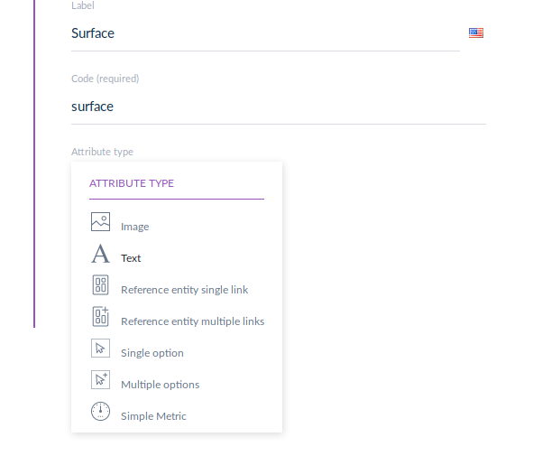
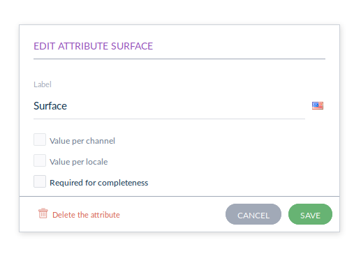

Create a new Reference Entity Attribute type
=====================================================

.. note::

   Reference Entities feature is only available for the **Enterprise Edition**.

This cookbook will present how to create your own Attribute Type for Reference Entities.
Currently, there are 6 types of Attribute for Reference Entities:

- Image
- Text
- Reference entity single link
- Reference entity multiple links
- Single Option
- Multiple Options

Requirements
------------

During this chapter, we assume that you already created and registered a new bundle to add your custom Reference Entity Attribute. Let's assume its namespace is ``Acme\\CustomBundle``.

Create the Attribute
--------------------

For this tutorial, we will create a **custom metric attribute** type for reference entity.
So we'll be able to create this kind of attribute on any Reference Entity:

And to edit its common properties:

.. note::

   **A small word on our architecture:**

   For the reference entities, we followed the Hexagonal architecture. So we split our classes in 3 different layers: Domain, Application & Infrastructure.

   - First we'll create **Domain** classes (the new custom ``SimpleMetricAttribute`` itself and its ``Value Object``)
   - Then **Application** classes (only Commands from CQRS principle (https://martinfowler.com/bliki/CQRS.html) and regular updaters)
   - And to finish **Infrastructure** classes (an Hydrator to hydrate our ``SimpleMetricAttribute`` coming from SQL)

   It's **not mandatory to respect this architecture** in your custom project.

1) Your new Custom Attribute Entity
^^^^^^^^^^^^^^^^^^^^^^^^^^^^^^^^^^^

Let's start with our new custom Attribute. It must extend the ``\Akeneo\ReferenceEntity\Domain\Model\Attribute\AbstractAttribute``.

.. code-block:: php

    <?php

    namespace Acme\CustomBundle\Attribute;

    use Akeneo\ReferenceEntity\Domain\Model\Attribute\AbstractAttribute;
    use Akeneo\ReferenceEntity\Domain\Model\Attribute\AttributeCode;
    use Akeneo\ReferenceEntity\Domain\Model\Attribute\AttributeIdentifier;
    use Akeneo\ReferenceEntity\Domain\Model\Attribute\AttributeIsRequired;
    use Akeneo\ReferenceEntity\Domain\Model\Attribute\AttributeOrder;
    use Akeneo\ReferenceEntity\Domain\Model\Attribute\AttributeValuePerChannel;
    use Akeneo\ReferenceEntity\Domain\Model\Attribute\AttributeValuePerLocale;
    use Akeneo\ReferenceEntity\Domain\Model\LabelCollection;
    use Akeneo\ReferenceEntity\Domain\Model\ReferenceEntity\ReferenceEntityIdentifier;

    class SimpleMetricAttribute extends AbstractAttribute
    {
        public static function createSimpleMetric(
            AttributeIdentifier $identifier,
            ReferenceEntityIdentifier $referenceEntityIdentifier,
            AttributeCode $code,
            LabelCollection $labelCollection,
            AttributeOrder $order,
            AttributeIsRequired $isRequired,
            AttributeValuePerChannel $valuePerChannel,
            AttributeValuePerLocale $valuePerLocale
        ) {
            return new self(
                $identifier,
                $referenceEntityIdentifier,
                $code,
                $labelCollection,
                $order,
                $isRequired,
                $valuePerChannel,
                $valuePerLocale
            );
        }

        /**
         * {@inheritdoc}
         */
        protected function getType(): string
        {
            return 'simple_metric';
        }
    }

2) Create the attribute
^^^^^^^^^^^^^^^^^^^^^^^

Now that we have our Attribute model class, we need to create classes to handle its creation.

We'll need first to add the "Creation command", it needs to extend ``\Akeneo\ReferenceEntity\Application\Attribute\CreateAttribute\AbstractCreateAttributeCommand``.

.. code-block:: php

    <?php

    namespace Acme\CustomBundle\Attribute;

    use Akeneo\ReferenceEntity\Application\Attribute\CreateAttribute\AbstractCreateAttributeCommand;

    class CreateSimpleMetricAttributeCommand extends AbstractCreateAttributeCommand
    {
    }

To build this creation command, we need a factory:

.. code-block:: php

    <?php

    namespace Acme\CustomBundle\Attribute;

    use Acme\CustomBundle\Attribute\CreateSimpleMetricAttributeCommand;
    use Akeneo\ReferenceEntity\Application\Attribute\CreateAttribute\AbstractCreateAttributeCommand;
    use Akeneo\ReferenceEntity\Application\Attribute\CreateAttribute\CommandFactory\AbstractCreateAttributeCommandFactory;

    class CreateSimpleMetricAttributeCommandFactory extends AbstractCreateAttributeCommandFactory
    {
        public function supports(array $normalizedCommand): bool
        {
            return isset($normalizedCommand['type']) && 'simple_metric' === $normalizedCommand['type'];
        }

        public function create(array $normalizedCommand): AbstractCreateAttributeCommand
        {
            $this->checkCommonProperties($normalizedCommand);

            $command = new CreateSimpleMetricAttributeCommand(
                $normalizedCommand['reference_entity_identifier'],
                $normalizedCommand['code'],
                $normalizedCommand['labels'] ?? [],
                $normalizedCommand['is_required'] ?? false,
                $normalizedCommand['value_per_channel'],
                $normalizedCommand['value_per_locale']
            );

            return $command;
        }
    }

And we also need to register it with a specific tag:

.. code-block:: yaml

    acme.application.factory.create_simple_metric_attribute_command_factory:
        class: Acme\CustomBundle\Attribute\CreateSimpleMetricAttributeCommandFactory
        tags:
            - { name: akeneo_referenceentity.create_attribute_command_factory }

Now that we have our command created, we need a factory to create our brand new ``SimpleMetricAttribute``:

.. code-block:: php

    <?php

    namespace Acme\CustomBundle\Attribute;

    use Acme\CustomBundle\Attribute\CreateSimpleMetricAttributeCommand;
    use Acme\CustomBundle\Attribute\SimpleMetricAttribute;
    use Akeneo\ReferenceEntity\Application\Attribute\CreateAttribute\AbstractCreateAttributeCommand;
    use Akeneo\ReferenceEntity\Application\Attribute\CreateAttribute\AttributeFactory\AttributeFactoryInterface;
    use Akeneo\ReferenceEntity\Domain\Model\Attribute\AbstractAttribute;
    use Akeneo\ReferenceEntity\Domain\Model\Attribute\AttributeCode;
    use Akeneo\ReferenceEntity\Domain\Model\Attribute\AttributeIdentifier;
    use Akeneo\ReferenceEntity\Domain\Model\Attribute\AttributeIsRequired;
    use Akeneo\ReferenceEntity\Domain\Model\Attribute\AttributeOrder;
    use Akeneo\ReferenceEntity\Domain\Model\Attribute\AttributeValuePerChannel;
    use Akeneo\ReferenceEntity\Domain\Model\Attribute\AttributeValuePerLocale;
    use Akeneo\ReferenceEntity\Domain\Model\LabelCollection;
    use Akeneo\ReferenceEntity\Domain\Model\ReferenceEntity\ReferenceEntityIdentifier;

    class SimpleMetricAttributeFactory implements AttributeFactoryInterface
    {
        public function supports(AbstractCreateAttributeCommand $command): bool
        {
            return $command instanceof CreateSimpleMetricAttributeCommand;
        }

        public function create(
            AbstractCreateAttributeCommand $command,
            AttributeIdentifier $identifier,
            AttributeOrder $order
        ): AbstractAttribute {
            if (!$this->supports($command)) {
                throw new \RuntimeException(
                    sprintf(
                        'Expected command of type "%s", "%s" given',
                        CreateSimpleMetricAttributeCommand::class,
                        get_class($command)
                    )
                );
            }

            return SimpleMetricAttribute::createSimpleMetric(
                $identifier,
                ReferenceEntityIdentifier::fromString($command->referenceEntityIdentifier),
                AttributeCode::fromString($command->code),
                LabelCollection::fromArray($command->labels),
                $order,
                AttributeIsRequired::fromBoolean($command->isRequired),
                AttributeValuePerChannel::fromBoolean($command->valuePerChannel),
                AttributeValuePerLocale::fromBoolean($command->valuePerLocale)
            );
        }
    }

Don't forget to register it:

.. code-block:: yaml

    acme.application.factory.simple_metric_attribute_factory:
        class: Acme\CustomBundle\Attribute\SimpleMetricAttributeFactory
        tags:
            - { name: akeneo_referenceentity.attribute_factory }

.. note::

    For your attribute type to appear translated in the UI, you can add the key
    ``pim_reference_entity.attribute.type.simple_metric`` in the JS translation file
    (located in ``src/Acme/CustomBundle/Resources/translations/jsmessages.en.yml``)

3) Edit the attribute
^^^^^^^^^^^^^^^^^^^^^

For the edition of this attribute, as for now it has no custom property, we don't have to create anything, it will be handled natively.

4) Retrieve the attribute
^^^^^^^^^^^^^^^^^^^^^^^^^

Now that we have our custom Attribute and commands to create/edit it, we'll need to have a way to Hydrate it from the DB for example:

.. code-block:: php

    <?php

    namespace Acme\CustomBundle\Attribute;

    use Acme\CustomBundle\Attribute\SimpleMetricAttribute;
    use Akeneo\ReferenceEntity\Domain\Model\Attribute\AbstractAttribute;
    use Akeneo\ReferenceEntity\Domain\Model\Attribute\AttributeCode;
    use Akeneo\ReferenceEntity\Domain\Model\Attribute\AttributeIdentifier;
    use Akeneo\ReferenceEntity\Domain\Model\Attribute\AttributeIsRequired;
    use Akeneo\ReferenceEntity\Domain\Model\Attribute\AttributeOrder;
    use Akeneo\ReferenceEntity\Domain\Model\Attribute\AttributeValuePerChannel;
    use Akeneo\ReferenceEntity\Domain\Model\Attribute\AttributeValuePerLocale;
    use Akeneo\ReferenceEntity\Domain\Model\LabelCollection;
    use Akeneo\ReferenceEntity\Domain\Model\ReferenceEntity\ReferenceEntityIdentifier;
    use Akeneo\ReferenceEntity\Infrastructure\Persistence\Sql\Attribute\Hydrator\AbstractAttributeHydrator;
    use Doctrine\DBAL\Platforms\AbstractPlatform;

    class SimpleMetricAttributeHydrator extends AbstractAttributeHydrator
    {
        protected function getExpectedProperties(): array
        {
            // We at least expect common properties
            return [
                'identifier',
                'reference_entity_identifier',
                'code',
                'labels',
                'attribute_order',
                'is_required',
                'value_per_locale',
                'value_per_channel',
                'attribute_type'
            ];
        }

        protected function convertAdditionalProperties(AbstractPlatform $platform, array $row): array
        {
            return $row;
        }

        protected function hydrateAttribute(array $row): AbstractAttribute
        {
            return SimpleMetricAttribute::createSimpleMetric(
                AttributeIdentifier::fromString($row['identifier']),
                ReferenceEntityIdentifier::fromString($row['reference_entity_identifier']),
                AttributeCode::fromString($row['code']),
                LabelCollection::fromArray($row['labels']),
                AttributeOrder::fromInteger($row['attribute_order']),
                AttributeIsRequired::fromBoolean($row['is_required']),
                AttributeValuePerChannel::fromBoolean($row['value_per_channel']),
                AttributeValuePerLocale::fromBoolean($row['value_per_locale'])
            );
        }

        public function supports(array $result): bool
        {
            return isset($result['attribute_type']) && 'simple_metric' === $result['attribute_type'];
        }
    }

And to register it:

.. code-block:: yaml

    # src/Acme/CustomBundle/Resources/config/services.yml

    services:
        acme.infrastructure.persistence.hydrator.attribute.simple_metric_attribute_hydrator:
            class: Acme\CustomBundle\Attribute\SimpleMetricAttributeHydrator
            arguments:
                - '@database_connection'
            tags:
                - { name: akeneo_referenceentity.attribute_hydrator }

Frontend Part of The New Attribute Type
---------------------------------------

To be able to create your brand new Simple Metric attribute on a Reference Entity, we need to add some code in the frontend part.

To do so, you can put all needed code in one single file but you can (and are encouraged) to split it into multiple
files if needed.

To keep this example simple, we will create everything in this file :

``src/Acme/CustomBundle/Resources/public/reference-entity/attribute/simple_metric.tsx``

.. note::

    If you create a new attribute type, Akeneo will need three things to manage it in the frontend:

    - A **model**: a representation of your attribute, its properties and overall behaviour
    - A **reducer**: to be able to know how to modify its custom properties and react to the user intentions (see https://redux.js.org/)
    - A **view**: as a React component to be able to render a user interface and dispatch events to the application

1) Model
^^^^^^^^

The model of your custom attribute will contain the common properties of an attribute (code, labels, channel, etc) but also its custom properties
and behaviours (*even if for now, our Simple Metric attribute doesn't have any*). To integrate it with the rest of the PIM, your attribute needs to implement the Attribute interface and provide a denormalizer.

This is the purpose of this section: provide a denormalizer capable of creating your custom attribute implementing Attribute interface.

.. code-block:: javascript

    /**
     * ## Import section
     *
     * This is where your dependencies to external modules are, using the standard import method (see https://developer.mozilla.org/en-US/docs/Web/JavaScript/Reference/Statements/import)
     * The paths are relative to the web/bundles folder (at the root of your PIM project)
     */
    import Identifier, {createIdentifier} from 'akeneoreferenceentity/domain/model/attribute/identifier';
    import ReferenceEntityIdentifier, {
      createIdentifier as createReferenceEntityIdentifier,
    } from 'akeneoreferenceentity/domain/model/reference-entity/identifier';
    import LabelCollection, {createLabelCollection} from 'akeneoreferenceentity/domain/model/label-collection';
    import AttributeCode, {createCode} from 'akeneoreferenceentity/domain/model/attribute/code';
    import {
      NormalizedAttribute,
      Attribute,
      ConcreteAttribute,
    } from 'akeneoreferenceentity/domain/model/attribute/attribute';

    /**
     * This interface will represent your normalized attribute (usually coming from the backend but also used in the reducer)
     */
    export interface NormalizedSimpleMetricAttribute extends NormalizedAttribute {
      type: 'simple_metric';
    }

    /**
     * Here we define the interface for our concrete class (our model) extending the base attribute interface
     */
    export interface SimpleMetricAttribute extends Attribute {
      normalize(): NormalizedSimpleMetricAttribute;
    }

    /**
     * Here we are starting to implement our custom attribute class.
     * Note that most of the code is due to the custom property (defaultValue). If you don't need to add a
     * custom property to your attribute, the code can be stripped to it's minimal
     */
    export class ConcreteSimpleMetricAttribute extends ConcreteAttribute implements SimpleMetricAttribute {
      /**
       * Here, our constructor is private to be sure that our model will be created through a named constructor
       */
      private constructor(
        identifier: Identifier,
        referenceEntityIdentifier: ReferenceEntityIdentifier,
        code: AttributeCode,
        labelCollection: LabelCollection,
        valuePerLocale: boolean,
        valuePerChannel: boolean,
        order: number,
        is_required: boolean
      ) {
        super(
          identifier,
          referenceEntityIdentifier,
          code,
          labelCollection,
          'simple_metric',
          valuePerLocale,
          valuePerChannel,
          order,
          is_required
        );

        /**
         * This will ensure that your model is not modified after it's creation (see https://developer.mozilla.org/en-US/docs/Web/JavaScript/Reference/Global_Objects/Object/freeze)
         */
        Object.freeze(this);
      }

      /**
       * Here, we denormalize our attribute
       */
      public static createFromNormalized(normalizedSimpleMetricAttribute: NormalizedSimpleMetricAttribute) {
        return new ConcreteSimpleMetricAttribute(
          createIdentifier(normalizedSimpleMetricAttribute.identifier),
          createReferenceEntityIdentifier(normalizedSimpleMetricAttribute.reference_entity_identifier),
          createCode(normalizedSimpleMetricAttribute.code),
          createLabelCollection(normalizedSimpleMetricAttribute.labels),
          normalizedSimpleMetricAttribute.value_per_locale,
          normalizedSimpleMetricAttribute.value_per_channel,
          normalizedSimpleMetricAttribute.order,
          normalizedSimpleMetricAttribute.is_required
        );
      }

      /**
       * The only method to implement here: the normalize method. Here you need to provide a serializable object (see https://developer.mozilla.org/en-US/docs/Glossary/Serialization)
       */
      public normalize(): NormalizedSimpleMetricAttribute {
        return {
          ...super.normalize(),
          type: 'simple_metric'
        };
      }
    }

    /**
     * The only required part of the file: exporting a denormalize method returning a custom attribute implementing Attribute interface
     */
    export const denormalize = ConcreteSimpleMetricAttribute.createFromNormalized;

2) Reducer
^^^^^^^^^^

Now that we have our attribute model in the frontend, we need to define our Reducer to know how to modify custom properties and react to the user intentions.
We'll see later how to handle those custom properties, for now, it's going to be a really simple reducer.

.. code-block:: javascript

    /**
     * Our custom attribute reducer needs to receive the normalized custom attribute as input, the code of the additional property and the value of the additional property.
     * It returns the normalized custom attribute.
     */
    const simpleMetricAttributeReducer = (
      normalizedAttribute: NormalizedSimpleMetricAttribute,
      propertyCode: string
    ): NormalizedSimpleMetricAttribute => {
      switch (propertyCode) {
        // Our future custom behaviour will go there
        default:
          break;
      }

      return normalizedAttribute;
    };

    /**
     * The only required part of the file: exporting the custom attribute reducer.
     * Be aware that the export has to be named ``reducer``
     */
    export const reducer = simpleMetricAttributeReducer;

3) View
^^^^^^^

The last part we need to do, it's to create the React component to be able to render a user interface and dispatch events to the application (https://reactjs.org/docs/react-component.html).

.. code-block:: javascript

    const SimpleMetricAttributeView = () => {
      return '';
    };

    /**
     * The only required part of the file: exporting the custom attribute view. Note that the export name has to be ``view``
     */
    export const view = SimpleMetricAttributeView;

4) Register our custom attribute
^^^^^^^^^^^^^^^^^^^^^^^^^^^^^^^^

To be able to have everything working, we need to register our custom attribute in the ``src/Acme/CustomBundle/Resources/config/requirejs.yml`` :

.. code-block:: yaml

    config:
        config:
            akeneoreferenceentity/application/configuration/attribute:
                simple_metric:
                    icon: bundles/pimui/images/attribute/icon-metric.svg
                    denormalize: '@custom/reference-entity/attribute/simple_metric.tsx'
                    reducer: '@custom/reference-entity/attribute/simple_metric.tsx'
                    view: '@custom/reference-entity/attribute/simple_metric.tsx'

.. note::
    Note that in this tutorial, we don't have any custom property for this attribute, we'll cover this point in `another tutorial`_.

.. _another tutorial: add_custom_property_to_your_custom_attribute_type.html

API Part of The New Attribute Type
---------------------------------------

1) Json schema validator when creating an attribute
^^^^^^^^^^^^^^^^^^^^^^^^^^^^^^^^^^^^^^^^^^^^^^^^^^^

To be able to validate an attribute when creating it through the API, you have to create a Json Schema validator.

.. code-block:: php

    <?php

    declare(strict_types=1);

    namespace Acme\CustomBundle\Attribute\JsonSchema;

    use JsonSchema\Validator;

    class SimpleMetricAttributeCreationValidator implements AttributeValidatorInterface
    {
        private const API_SIMPLE_METRIC_ATTRIBUTE_TYPE = 'simple_metric';

        public function validate(array $normalizedAttribute): array
        {
            $record = Validator::arrayToObjectRecursive($normalizedAttribute);
            $validator = new Validator();
            $validator->validate($record, $this->getJsonSchema());

            return $validator->getErrors();
        }

        public function forAttributeTypes(): array
        {
            return [self::API_SIMPLE_METRIC_ATTRIBUTE_TYPE];
        }

        private function getJsonSchema(): array
        {
            return [
                'type' => 'object',
                'required' => ['code', 'type', 'value_per_locale', 'value_per_channel'],
                'properties' => [
                    'code' => [
                        'type' => ['string'],
                    ],
                    'type' => [
                        'type' => ['string'],
                    ],
                    'labels' => [
                        'type' => 'object',
                        'patternProperties' => [
                            '.+' => ['type' => 'string'],
                        ],
                    ],
                    'value_per_locale' => [
                        'type' => [ 'boolean'],
                    ],
                    'value_per_channel' => [
                        'type' => [ 'boolean'],
                    ],
                    'is_required_for_completeness' => [
                        'type' => [ 'boolean'],
                    ]
                ],
                'additionalProperties' => false,
            ];
        }
    }

And to register it:

.. code-block:: yaml

    # src/Acme/CustomBundle/Resources/config/services.yml

    services:
        acme.infrastructure.connector.api.create.simple_metric_attribute_validator:
            class: Acme\CustomBundle\Attribute\JsonSchema\SimpleMetricAttributeCreationValidator
            tags:
                - { name: akeneo_referenceentity.connector.api.create.attribute_validator }

2) Json schema validator when editing an attribute
^^^^^^^^^^^^^^^^^^^^^^^^^^^^^^^^^^^^^^^^^^^^^^^^^^

The validation of the schema is not the same when editing an attribute through the API. Indeed, some properties are not mandatory.
So, you will have to create a new Json schema validator.

.. code-block:: php

    <?php

    declare(strict_types=1);

    namespace Acme\CustomBundle\Attribute\JsonSchema;

    use Akeneo\ReferenceEntity\Domain\Model\Attribute\AbstractAttribute;
    use Acme\CustomBundle\Attribute\SimpleMetricAttribute;
    use JsonSchema\Validator;

    class SimpleMetricAttributeEditValidator implements AttributeValidatorInterface
    {
        public function validate(array $normalizedAttribute): array
        {
            $record = Validator::arrayToObjectRecursive($normalizedAttribute);
            $validator = new Validator();
            $validator->validate($record, $this->getJsonSchema());

            return $validator->getErrors();
        }

        public function support(AbstractAttribute $attribute): bool
        {
            return $attribute instanceof SimpleMetricAttribute;
        }

        private function getJsonSchema(): array
        {
            return [
                'type' => 'object',
                'required' => ['code'],
                'properties' => [
                    'code' => [
                        'type' => ['string'],
                    ],
                    'type' => [
                        'type' => ['string'],
                    ],
                    'labels' => [
                        'type' => 'object',
                        'patternProperties' => [
                            '.+' => ['type' => 'string'],
                        ],
                    ],
                    'value_per_locale' => [
                        'type' => [ 'boolean'],
                    ],
                    'value_per_channel' => [
                        'type' => [ 'boolean'],
                    ],
                    'is_required_for_completeness' => [
                        'type' => [ 'boolean'],
                    ],
                    '_links' => [
                        'type' => 'object'
                    ],
                ],
                'additionalProperties' => false,
            ];
        }
    }

And to register it:

.. code-block:: yaml

    # src/Acme/CustomBundle/Resources/config/services.yml

    services:
        acme.infrastructure.connector.api.edit.simple_metric_attribute_validator:
            class: Acme\CustomBundle\Attribute\JsonSchema\SimpleMetricAttributeEditValidator
            tags:
                - { name: akeneo_referenceentity.connector.api.edit.attribute_validator }
