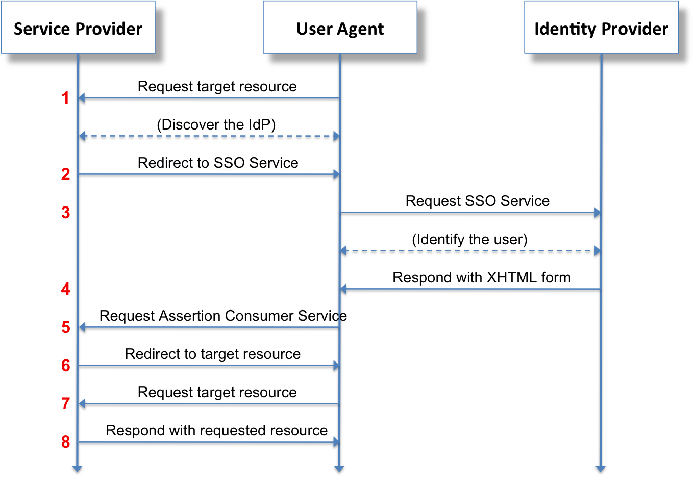

Use SSO authentication locally
==============================

This chapter describes how to enable the SSO authentication for development purpose.

How SSO works ?
---------------

| SSO means `Single Sign-On`, several SSO protocols exist.
| We implemented the ``SAMLv2`` protocol as it is a popular standard in the industry.
|

    Security Assertion Markup Language 2.0 (SAML 2.0) is a version of the SAML standard for exchanging authentication and authorization data between security domains.
    SAML 2.0 is an XML-based protocol that uses security tokens containing assertions to pass information about a principal (usually an end user) between a SAML authority, named an ``Identity Provider``, and a SAML consumer, named a ``Service Provider``.

    -- Source `Wikipedia <https://en.wikipedia.org/wiki/SAML_2.0>`_

The ``Identity Provider`` offers user authentication as a service, and the ``Service Provider`` could be considered as a client that will ask to authenticate a user.

The content exchanged between the IdP and the SP must be signed, that's why we have to configure those entities with ``Certificates`` and ``Private keys``.

Outbound single sign-on
-----------------------

Akeneo PIM is implementing *Outbound SAML*, that can also be called SP-initiated Single Sign-On (SSO) or traditional SAML. In an outbound SAML transaction a Service Provider (SP) like a website or an application redirects a user to a designated Identity Provider (IDP) for authentication and authorization. The IDP asks for the user's credentials and upon successful authentication redirects the user to the protected content.

All the exchanges, redirections between the browser, the Service Provider and the Identity Provider could be represented as follows:

Setting up the Identity Provider (IdP)
--------------------------------------

Using Docker
^^^^^^^^^^^^

We provide an already configured IdP server image in the ``docker-compose.yml`` file, named ``sso-idp-server``.

The following information is here if you want to tweak something, if not, go directly to the `Setting up the Service Provider (SP)` section.

This container will expose the ``8082`` port, you can override this value in the ``.env`` file.

You can access the IdP administration page at the following url: http://localhost:8082/simplesaml.

| Some users are already configured, the same that are in the `icecat_demo_dev fixtures <https://github.com/akeneo/pim-community-dev/blob/3.0/src/Akeneo/Platform/Bundle/InstallerBundle/Resources/fixtures/icecat_demo_dev/users.csv>`_.
| They are defined in the ``docker/sso_authsources.php``.

The configuration of the Service Provider is automatically provided by environment variables in the ``docker-compose.yml`` file line 58 (``SIMPLESAMLPHP_SP_ENTITY_ID``) of your standard archive.

Without Docker
^^^^^^^^^^^^^^

You can install an IdP server or use any SaaS service (Azure AD for example) that respect the ``SAMLv2`` protocol.

The configuration of the IdP depends on the solution you choose so you'll have to refer to its documentation.

You will have to configure the users:

* Add the users you'll want to be able to login into the pim (the user must exists in the pim).
* The attribute ``akeneo_uid`` will have to be sent in the Authentication response, and the value will have to match an existing pim user ``username`` attribute.

You will have to configure the Service Provider information with the following data:

* EntityId: http://your.akeneo-pim.url/saml/metadata
* Logout url: http://your.akeneo-pim.url/saml/logout
* ACS url: http://your.akeneo-pim.url/saml/acs

You will have to retrieve the IdP certificate, it will be needed to configure the Service Provider on the Akeneo PIM side.

Setting up the Service Provider (SP)
------------------------------------

* Go to the `sso configuration page`, under ``System/SAML-based Single Sign-On``
* Enable the feature using the "SSO Enable" toggle button
* Fill the form with the values provided by your IdP server
* Then click the Save button
* If everything went fine, you'll be logged out and redirected to the IdP login form

For the IdP provided in the docker-compose.yml
^^^^^^^^^^^^^^^^^^^^^^^^^^^^^^^^^^^^^^^^^^^^^^

* Entity ID: ``http://localhost:8082/simplesaml/saml2/idp/metadata.php``
* Login URL: ``http://localhost:8082/simplesaml/saml2/idp/SSOService.php``
* Logout URL: ``http://localhost:8082/simplesaml/saml2/idp/SingleLogoutService.php``
* Certificate: ``MIIDXTCCAkWgAwIBAgIJALmVVuDWu4NYMA0GCSqGSIb3DQEBCwUAMEUxCzAJBgNVBAYTAkFVMRMwEQYDVQQIDApTb21lLVN0YXRlMSEwHwYDVQQKDBhJbnRlcm5ldCBXaWRnaXRzIFB0eSBMdGQwHhcNMTYxMjMxMTQzNDQ3WhcNNDgwNjI1MTQzNDQ3WjBFMQswCQYDVQQGEwJBVTETMBEGA1UECAwKU29tZS1TdGF0ZTEhMB8GA1UECgwYSW50ZXJuZXQgV2lkZ2l0cyBQdHkgTHRkMIIBIjANBgkqhkiG9w0BAQEFAAOCAQ8AMIIBCgKCAQEAzUCFozgNb1h1M0jzNRSCjhOBnR+uVbVpaWfXYIR+AhWDdEe5ryY+CgavOg8bfLybyzFdehlYdDRgkedEB/GjG8aJw06l0qF4jDOAw0kEygWCu2mcH7XOxRt+YAH3TVHa/Hu1W3WjzkobqqqLQ8gkKWWM27fOgAZ6GieaJBN6VBSMMcPey3HWLBmc+TYJmv1dbaO2jHhKh8pfKw0W12VM8P1PIO8gv4Phu/uuJYieBWKixBEyy0lHjyixYFCR12xdh4CA47q958ZRGnnDUGFVE1QhgRacJCOZ9bd5t9mr8KLaVBYTCJo5ERE8jymab5dPqe5qKfJsCZiqWglbjUo9twIDAQABo1AwTjAdBgNVHQ4EFgQUxpuwcs/CYQOyui+r1G+3KxBNhxkwHwYDVR0jBBgwFoAUxpuwcs/CYQOyui+r1G+3KxBNhxkwDAYDVR0TBAUwAwEB/zANBgkqhkiG9w0BAQsFAAOCAQEAAiWUKs/2x/viNCKi3Y6blEuCtAGhzOOZ9EjrvJ8+COH3Rag3tVBWrcBZ3/uhhPq5gy9lqw4OkvEws99/5jFsX1FJ6MKBgqfuy7yh5s1YfM0ANHYczMmYpZeAcQf2CGAaVfwTTfSlzNLsF2lW/ly7yapFzlYSJLGoVE+OHEu8g5SlNACUEfkXw+5Eghh+KzlIN7R6Q7r2ixWNFBC/jWf7NKUfJyX8qIG5md1YUeT6GBW9Bm2/1/RiO24JTaYlfLdKK9TYb8sG5B+OLab2DImG99CJ25RkAcSobWNF5zD0O6lgOo3cEdB/ksCq3hmtlC/DlLZ/D8CJ+7VuZnS1rR2naQ==``

FAQ
---

What if I've wrongly configured my admin user and I can't access the PIM?
^^^^^^^^^^^^^^^^^^^^^^^^^^^^^^^^^^^^^^^^^^^^^^^^^^^^^^^^^^^^^^^^^^^^^^^^^

An original login form is here as a fallback in this situation, you can access it here: http://your.akeneo-pim.url/user/login

How can I debug authentication errors ?
^^^^^^^^^^^^^^^^^^^^^^^^^^^^^^^^^^^^^^^

Various errors can happen, those errors could be due to incorrect configuration on IdP side or SP side.

| Regarding the SP, on the SSO configuration page, you have a "download logs" button that will provide a ZIP of ``var/logs/saml/authentication*.log``
| You can also check these logs via CLI if your PIM installation is on premise or on PAAS.
| 

Regarding the IdP:
* For the one provided in docker-compose.yml, you can check logs outputed by the container ``docker logs -f your_sso-idp-server_container-name``
* For custom configuration of the IdP, refer to the documentation.
