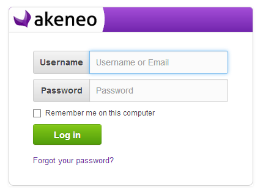
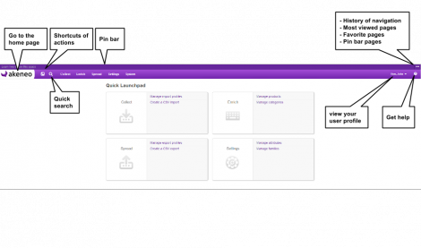

Getting started
===============

.. _logging-label:
Logging in Akeneo
-----------------

The login panel will be displayed if you have not logged in to Akeneo:

Log in to Akeneo
----------------

Enter your Username and Password and click the Log In button.
The dashboard will be displayed.
Please Note:

Selecting the Remember me on this computer check box will prevent you from being automatically logged out of Akeneo on a given browser and computer. However, your session will not be preserved, e.g. last search, current product, etc.

Cannot remember either your username or password
------------------------------------------------

Click Forgot you passowrd?
Enter your username or email specified in your Akeneo user profile.
Click Request. An url will emailed to the email address specified in your user profile.
If you have forgotten the email address specified in your user profile, you will need to contact your Akeneo administrator for help.

Exploring the workspace
-----------------------

The Dashboard is the first page you see (by default) after logging in to Akeneo.

The navigation bar (at the top of the screen) is the same on every screen in Akeneo. It contains links which give you quick access to many of Akeneo’s most useful functions.
The white area of the screen, below the top navigation bar, contains pages that you can pin or add to your favorites.

