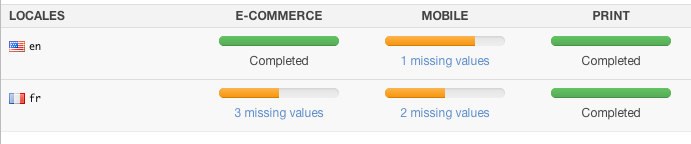
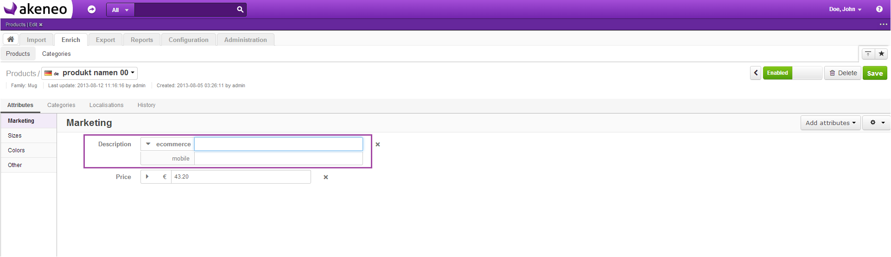
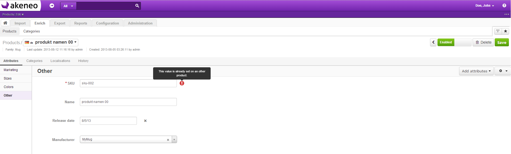
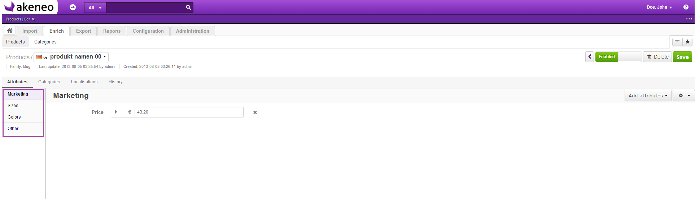

Key concepts
============

.. _channel-label:
What is a channel?
-------------------

A channel in Akeneo allows to select products and some of their information to be exported with a connector.

For example, you can have a channel for an e-commerce website, another one for an iPad application.

A channel works as a filter with the following properties:

- A classification tree — it defines products to export
- one or several :ref:`locales <locale-label>` —  it defines which values the channel requests: product information in french but not in italian, even if it exists
- one or several currencies — it defines which values the channel requests for prices: prices in Euro and Dollar
- metric conversion — it defines for each attribute typed ‘Metric’ if the values must be converted or not
- :ref:`Completeness <completeness-label>` — it defines which information is required or optional to select a product, depending on products family
- Disabled products are ignored by channels

.. _locale-label:
What is a locale?
------------------

**A locale** is the association between a language code (en, de , fr) and a country code (us, ca, uk). Each product in Akeneo can have different values per locale (for instance my product can have different values for en_us and en_ca).
Each locale of a product has its own lifecycle.

A locale is enabled or disabled. It is enabled when it is requested at least by one channel. If a locale is not requested by any channel, the locale is disabled. That means products cannot be localized for this locale.

Akeneo supports about 250 locales.

.. note::

    To know how to customize this list, see customize the list of locales.

Only attributes with the property “localizable” set to True can have a different value per locale.

.. note::

    See Defining attributes to know how to set this property for an attribute.

.. _completeness-label:
What is completeness?
----------------------

In Akeneo, a product is considered as complete when we have enough information to export this product to a channel.

The definition of completeness can vary:

- from a family to another: a TV will not require the same kind of data than a book or a shirt
- from a locale to another: you can have a complete product for your english catalog but still in a translation process for your german one
- from a channel to another: maybe your iPad application doesn’t need the same amount of data as your e-commerce website

Example
^^^^^^^

What is an attribute?
----------------------
An attribute is the smallest entity in Akeneo, which allows to manage information about products.

Note that the settings below can be defined and customized by your Akeneo administrator to suit your needs.

General properties
^^^^^^^^^^^^^^^^^^

Some of the most important properties are described below.

Code
""""
All attributes have a unique code which identifies them for import and export operations.

Type
""""
Akeneo can be used to manage many different types of attributes, by defining the kind of data that this attribute can handle (see attribute type below):

- Yes/No
- Text
- Simple select
- Multi-select
- Date
- Price
- Number
- Image
- File
- Metric
- Text area

.. warning::

    Once created, this parameter can not be edited anymore.

Identifier type
"""""""""""""""
The attribute type “Identifier” allow to use an attribute as the identifier of all products in Akeneo.

This identifier can be used for one attribute only (mostly the attribute “SKU”). It is the only attribute required to create a product.

Scope
"""""
An attribute can have different values, depending on the :ref:`channel <channel-label>`: a description of the product for the mobile app, and another one for the E-commerce website.

.. warning::

    Attribute type Price is not scopable.

Localization
""""""""""""

Akeneo manages the process of translating a product in different languages and adapting product values for a specific country or region (dates, currencies, formatting numbers …).

That means attributes can be localized if needed.

Locale specific

An attribute can be shown only for specific locales. It is useful for specific taxes for example.

Uniqueness

Akeneo can guarantee the uniqueness of values of an attribute, should it be unique (mostly used for the SKU attribute).

.. warning::

    If an attribute is scopable or localizable, it cannot be unique.

.. note::

    Once created, this parameter can not be edited anymore.

Back-end properties
^^^^^^^^^^^^^^^^^^^

An attribute can be used for some features in Akeneo:
- Searchable: Defines if the search engine should index / use this attribute value
- Usable as a filter: The attribute can be used as a filter in the products grid
- Usable as a column: The attribute can be used as a column in the products grid

Attribute group
"""""""""""""""

Each attribute can belong to an attribute group.

An attribute group allows to organize the product form by themes (SEO, Marketing, General) so that the product form is more understandable.

An attribute can belong to only one attribute group.

By default, the attribute belongs to the Akeneo’s attribute group, named “Others”.

.. note::

    See the Akeneo Administrator’s Guide to learn how to create new attributes or attribute groups channels.
