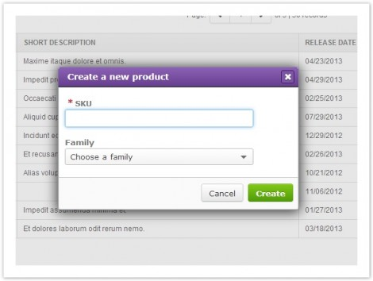

Working with products
=====================

Create a new product
--------------------

1 - Click New product button at the top of the Products grid page  to open the Create product dialog box.

2 - Type the Identifier (in the screenshot, it is the SKU) of the product, and optionally, choose a family to initiate a template and apply completeness. The identifier is the only required attribute to create a product. It is defined during the installation and configuration of Akeneo.
Applying a family is optional, a product without a family will have no attributes. You will have to add them manually. Fore more details, please refer to Adding attributes to a product.

3 - Click Create button so that Akeneo creates the product and opens the product edit form.

.. note::

    You can create products by importing them from an external system. For more details, see Importing products.

Import products
---------------

Importing products is useful especially if you want to update your products from third party systems.

The Akeneo CSV connector allows you to import product information from a CSV file in two ways:

- Directly from Akeneo user interfaces
- From a path given in the configuration of the import profile
- When importing products, Akeneo extracts data from your CSV file and integrates it into your PIM

CSV files are text files representing tabulated data and are supported by most applications that handle tabulated data (for e.g. Microsoft Excel, databases, etc.).

The CSV import process consists of:

Creating an import profile. See Managing import profiles for this step.
Preparing your CSV file.
Running the CSV file import.

.. note::

    You can configure the settings of import data by a CSV file (delimiter, scope, etc…) by Managing import profiles.

Preparing your CSV file
-----------------------

A CSV (comma-separated values) file stores tabular data (numbers and text) in plain-text form.

.. warning::

    The Akeneo CSV connector assumes that your CSV file is based on the configuration of the import profile you will use: Separation of fields, enclosures, etc…

The first line of your product CSV has to include the field headers described below, with each separated by a delimiter.

.. note::

   The order doesn’t matter. Subsequent lines in the file should contain data for your product using those same fields in that exact same order.

When a field is not in the file, it is ignored. For example, if an attribute is not in the CSV file, it will not be updated with an empty value.

Here’s a description of each type of field:

Attribute used as identifier
----------------------------

The Identifier is the unique way to identify each product. Every line in the CSV contains a different identifier.

.. note::

    The identifier is the only mandatory attribute to import products.

Example

sku;family;
Sku-101;shoe;
Sku-102;shoe;
Sku-103;shoe;

Family
------

The header of the field family should be defined in the import profile. See Managing import profiles to learn the name of the field for family.

If there is no family defined for a product, it will be considered without family. That means all imported attributes will be added without using a family’s template, and the product will not have completeness calculated.
You can import products with different families in the same CSV file.

Families must exist in Akeneo. Use codes of families in CSV file.

Example

sku;family;
Sku-101;shoe;
Sku-102;Mug;
Sku-103;;
You can set or change the family of an existing product in Akeneo. Be careful with the column family.

Categories
----------

The header of the field categories should be defined in the import profile.

Example

sku;family;categories;
Sku-101;shoe;shoes,clothes;
Sku-102;Mug;goodies;
Sku-103;;
If there are no categories defined for a product, it will be not classified. Classification is optional for importing products.
You can classify products within different categories in the same CSV file.
Categories must exist in Akeneo. Use codes of categories in CSV file.

Enabled
-------

The header of the field enabled is optional. It allows to change the status of products: 0 = disabled, 1 = enabled.

You can also define the value of enabled for all products you are importing in the configuration of the import profile. In this case, you don’t need to add the column ‘enabled’ in the CSV file.
Example
sku;family;categories;enabled
Sku-101;shoe;shoes,clothes;0;
Sku-102;Mug;goodies;0;
Sku-103;;;1;

Attributes
----------

The product information is linked to attributes. The header of fields for attributes are composed of the code of the attribute, and, if the attribute is localized, the code of the locale.
Attributes must exist in Akeneo for importing product’s values. Akeneo CSV connector will not create attributes when importing product information.
If the product doesn’t exist in Akeneo, it will be created. If the product already exists in Akeneo, it will be updated with values in CSV file only. Other attributes existing in Akeneo will not be updated.

If you want to add multiple values for an attribute to a product, you should use commas for the same attribute. See example with categories.

For attribute type select (simple select or multi-select), use codes of options.

For attribute type image or file, give the path and the name of the file.

Example

sku;family;categories,short_description-en_US;short_description-fr_FR;color;name-en_US;name-fr_FR;size;
Sku-101;shoe;apparels_shoes,shoes,shoes_woman;beautiful shoes;belles chaussures;PURPLE,RED;Butterfly shoes;Chaussures Papillon;8
Sku-102;Mug;;;;;;;;
Sku-103;;computers;;;GREEN;;;12

Prices
------

You can have a price for each channel and for each locale. The currency can be the same for all prices, or there are several currencies. That’s why there are as many columns of prices as there are currencies.

In the column for the attributes prices, give the values only, without spaces, without commas, and without the code of the currency.

Example

sku;family;price-en_US-mobile-EUR;price-fr_FR-mobile-EUR;categories,short_description-en_US;short_description-fr_FR;color;name-en_US;name-fr_FR;size;image_example
Sku-101;shoe;15,15;apparels_shoes,shoes,shoes_woman;beautiful shoes;belles chaussures;PURPLE,RED;Butterfly shoes;Chaussures Papillon;8;gallery/images/example.png
Sku-102;Mug;120,120;;;;;;;;
Sku-103;;50,75;computers;;;GREEN;;;12;default.jpg

Images and Files
----------------

You can upload an archive (zip) with files and images for different products in order to import them. In the column for the attributes images or files, give the path in the archive where Akeneo will upload images & files.

.. Example::

    sku;family;price-USD;categories,short_description-en_US;short_description-fr_FR;color;name-en_US;name-fr_FR;size;image_example
    Sku-101;shoe;19;apparels_shoes,shoes,shoes_woman;beautiful shoes;belles chaussures;PURPLE,RED;Butterfly shoes;Chaussures Papillon;8;gallery/images/example.png
    Sku-102;Mug;124;;;;;;;;
    Sku-103;;75;computers;;;GREEN;;;12;default.jpg

Running the CSV file import
---------------------------

To upload and run an import profile with CSV file:

Go to ‘Extract > Import profiles’ to display the import profiles grid.
Select the import profile you want to use to import products with your CSV file by clicking the row.
The configuration page of the import profile opens. If the option is available, click the button ‘Upload and import‘.
A space appears to drop a file. You can also click the area to open your device’s directory.
Click ‘upload and import now‘.
Akeneo displays a message to inform if the import is successful or if it has failed. An email is sent to your mail box to give you details about the import process.
To run an import profile with a path to retrieve the CSV file:

Go to ‘Extract > Import profiles’ to display the import profiles grid.
Select the import profile you want to use to import products with your CSV file by clicking the row.
The configuration page of the import profile opens. Click the button ‘Import now‘.
Akeneo displays a message to inform if the import is successful or if it has failed. An email is sent to your mail box to give you details about the import process.
